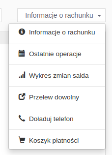
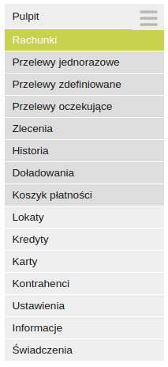

# Ocena interfejsu strony internetowej banku

## Strona główna

Po wejściu na [stronę główną](https://bsbialogard.pl) powita nas menu składające się z prostokątnych kafelków. Minusem jest to, że ten z napisem „*LOGOWANIE*” nie przyciąga moim zdaniem szczególnie uwagi. Gdy spróbujemy wejść na stronę główną na urządzeniu mobilnym, które ma wąski ekran, to przycisk logowania znajduje się wówczas na samej górze, więc problem się tam nie pojawia.

## Logowanie

Sama strona logowania jest z początku dość standardowa - pojawia się prośba o podanie identyfikatora. Od razu, na pierwszy rzut oka, widać gdzie należy go wpisać.

Po kliknięciu w pole tekstowe pojawia się również przycisk służący do otworzenia klawiatury ekranowej.

Z niewiadomej przyczyny przycisk ten nie jest widoczny przed aktywowaniem pola do wpisywania identyfikatora. W przypadku, gdy ktoś szczególnie przejmujący się bezpieczeństwem (obawiający się na przykład keyloggerów) chciałby skorzystać z tej opcji, to na pierwszy rzut oka mógłby odnieść wrażenie, że klawiatura ekranowa nie jest dostępna.

Nieco ciekawiej robi się gdy przejdziemy dalej, do etapu wpisywania hasła. Dodatkowym zabezpieczeniem (prawdopodobnie przed stronami podszywającymi się pod ten ekran logowania) jest pojawiający się obrazek, który wybiera się podczas pierwszego logowania na konto (łatwo jest zwrócić uwagę na to, że nie zgadza się on z tym wybranym).

Olbrzymim minusem (moim zdaniem) jest natomiast samo pole gdzie należy wpisywać hasło - a dokładniej kilka wybranych jego liter. Jest to nowa zmiana jaką wprowadził ten bank (wcześniej wpisać trzeba było całe hasło), która jest idealnym dowodem prawdziwości „twierdzenia zpl-a o jakości i użyteczności interfejsu" - najlepszym interfejsem jest taki, do jakiego jesteśmy przyzwyczajeni. Normalnie, po pewnym czasie, hasło wpisuje się automatycznie, bez myślenia o tym, polegając jedynie na pamięci mięśniowej. Konieczność wpisywania kilku wybranych liter sprawia jednak, że trzeba zastanawiać się nad tym, jaka litera jest która w naszym haśle. Powoduje to, że sam proces logowania (w moim przypadku) staje się kilkakrotnie dłuższy, przez konieczność liczenia znaków.

Gdy już przebrniemy przez to (okropne) pole tekstowe pojawi się kolejne, w którym należy wpisać kod wysyłany SMSem.

## Interfejs

Po zalogowaniu przed naszymi oczami pojawia się „Pulpit” – strona, na której znajdują się podstawowe informacje o stanie naszego konta, takie jak jego numer lub wolne środki. Można tam wygodnie przełączać się pomiędzy zakładkami z ostatnimi operacjami czy wykresem zmian salda. 

Pojawiają się one na rozwijanej liście po prawej stronie, która od razu pojawia się rozwinięta, sygnalizując możliwość wybrania jednej z opcji.

Inne rzeczy również bardzo łatwo można znaleźć w menu po lewej stronie. Wszystkie opcje poukładane są w sensowny sposób w bardziej ogólnych kategoriach.

Formularze do (na przykład) przelewów są bardzo standardowe. W przypadku wątpliwości co należy wpisać, na górze ekranu znajduje się przycisk do otworzenia okienka z pomocą, w którym znajdują się objaśnienia wszystkich opcji. Jest to standardowa ikona ze znakiem zapytania, która położona jest w widocznym miejscu, ale być może nie dla wszystkich jej znaczenie musi być oczywiste (przykładowo znakiem informacji turystycznej jest litera „*i*", osoba starsza, nie mająca na co dzień styczności z internetem czy komputerami w ogóle, może nie skojarzyć znaku zapytania z pomocą).

## Podsumowanie

Podsumowując, BS w Białogardzie ma stronę internetową, którą można uznać za *przyzwoitą*. Wszystko działa jak należy, lecz sposób logowania się jest frustrujący. Nawigacja po stronie jest intuicyjna a istnienie interfejsu staje się w zasadzie niezauważalne (co powinno być podstawowym celem przy jego projektowaniu).