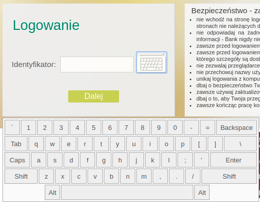
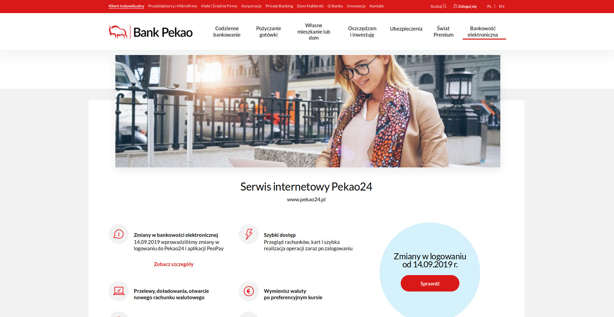
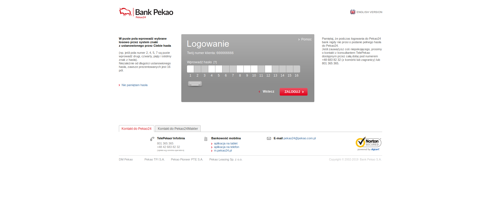
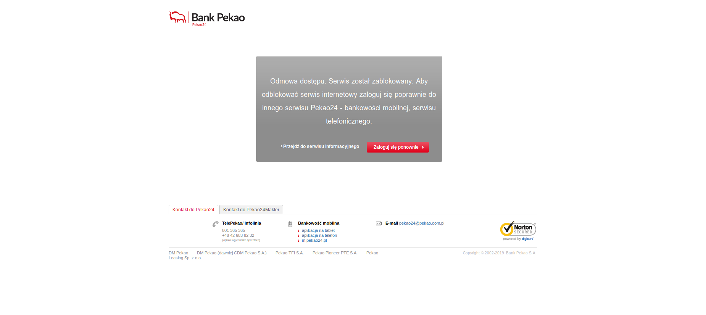
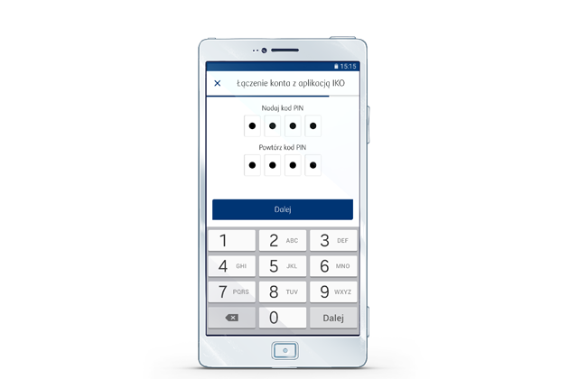
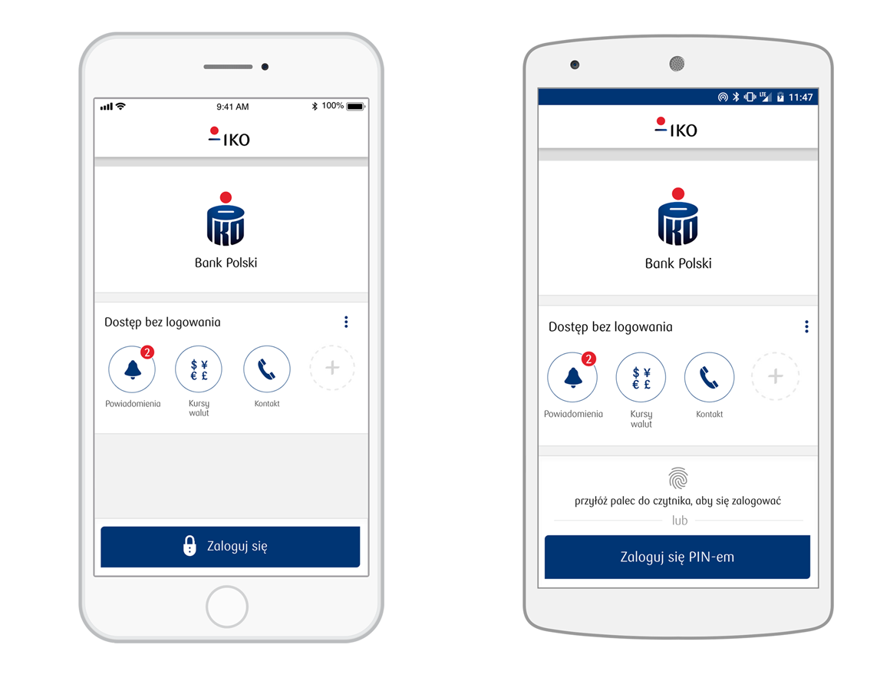

# Ocena systemów logowania do bankowości elektronicznej

Członkowie grupy:
1. Jakub Grobelny
2. Kacper Bukowiec
3. Jakub Remiszewski 

***

## 1. Bank Spółdzielczy w Białogardzie

### Strona główna

Po wejściu na [stronę główną](https://bsbialogard.pl) powita nas menu składające się z prostokątnych kafelków. Minusem jest to, że ten z napisem „*LOGOWANIE*” nie przyciąga moim zdaniem szczególnie uwagi (na samym początku go nie zauważyłem choć jest to być może problem z użytkownikiem a nie z samym designem). Gdy spróbujemy wejść na stronę główną na urządzeniu mobilnym, które ma wąski ekran, to przycisk logowania znajduje się wówczas na samej górze, więc nie jest to tam problemem.

### Logowanie

Sama strona logowania jest z początku dość standardowa - pojawia się prośba o podanie identyfikatora. Od razu intuicyjnie jasne jest gdzie należy go wpisać.

Po kliknięciu w pole tekstowe pojawia się również przycisk służący do otworzenia klawiatury ekranowej.

Z niewiadomej przyczyny przycisk ten nie jest widoczny przed aktywowaniem pola do wpisywania identyfikatora. W przypadku, gdy ktoś szczególnie przejmujący się bezpieczeństwem (obawiający się na przykład keyloggerów) chciałby skorzystać z tej opcji, to na pierwszy rzut oka mógłby odnieść wrażenie, że klawiatura ekranowa nie jest dostępna.

Nieco ciekawiej robi się gdy przejdziemy dalej, do etapu wpisywania hasła. Dodatkowym zabezpieczeniem (prawdopodobnie przed stronami podszywającymi się pod ten ekran logowania) jest pojawiający się obrazek, który wybiera się podczas pierwszego logowania na konto (łatwo jest zauważyć, gdy nie zgadza się on z tym wybranym).

Olbrzymim minusem (moim zdaniem) jest natomiast samo pole gdzie należy wpisywać hasło - a dokładniej kilka wybranych jego liter. Jest to relatywnie nowa zmiana jaką wprowadził ten bank (wcześniej wpisać trzeba było całe hasło). Normalnie wpisywanie całego hasła jest bardzo szybkim procesem – dzięki pamięci mięśniowej robi się to często praktycznie bez zastanowienia. Używany w tym banku system powoduje jednak, że za każdym razem, przy wpisywaniu hasła należy liczyć, która litera jest która. Łatwo jest o pomyłkę i cała czynność trwa kilkukrotnie dłużej niż jest to konieczne.

Gdy już przebrniemy przez to pole tekstowe, pojawi się kolejne, w którym należy wpisać kod wysyłany SMSem.

### Podsumowanie

Podsumowując, BS w Białogardzie ma stronę internetową, którą można uznać za *przyzwoitą*. Wszystko działa jak należy, lecz sposób logowania jest frustrujący. Nawigacja po stronie jest intuicyjna chociaż jej responsywność pozostawia czasami wiele do życzenia.

***

## 2. Bank Pekao

Po wejściu na główną stronę banku wszystko wygląda w porządku, choć 
przycisk do zalogowania się może być trochę zbyt mały.

Po przejściu do ekranu logowania musimy najpierw wpisać numer klienta, potem zostaniemy przekierowani do ekranu wpisania hasła. Miejsce na numer klienta i hasło znajduje się w centrum ekranu i jest dobrze widoczne.

Zamiast pełnego hasła wpisujemy tylko wybrane znaki z hasła. Uważam że takie rozwiązanie może jest bezpieczniejsze, ale jest też bardzo niewygodne.

Sam obecnie zablokowałem sobię wersję przeglądarkową banku (używam teraz wersji mobliniej, która jest wygodniejsza). 

Podczas wpisywania hasła nie wyświetla się informacja o włączonym przycisku Caps Lock, a gdy z jakiegoś powodu gdy wciśniemy dowolną strzałkę na klawiaturze, to w pole zostanie wpisany "pusty" znak.

Jeśli otworzymy stronę główną na urządzeniu mobilnym zamiast napisu zaloguj będzie tylko kłódka, dla niektórych osób może być to mylące.

***

## 3. Aplikacja mobilna PKO BP

Aplikacja pozwala na zalogowanie się poprzez 2 sposoby. Pierwszym jest podanie 4 cyfrowego PINu. PIN ten jest nadawany przy instalacji aplikacji, istnieje także możliwość zmienienia go wewnątrz aplikacji. Drugim sposobem jest skan biometryczny palca użytkownika. Interfejs logowania sam w sobie jest bardzo przejrzysty ze względu na stosunkową prostotę oraz dobrze dobrane kolory.

Ze strony logowania można także uzyskać dostęp do udostępnianych przez bank, np kursy walut oraz powiadomienia. Możliwy jest także kontakt z obsługą klienta.