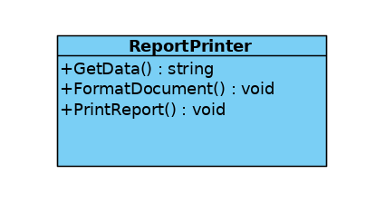
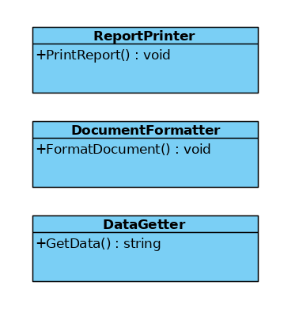

- **Dokonać analizy projektu obiektowego pod katem zgodności z zasadą SRP.**

```csharp
public class ReportPrinter {
    public string GetData();
    public void FormatDocument();
    public void PrintReport();
}
```

Korzystamy z *testu odpowiedzialności SRP*.

1. **+** `ReportPrinter` <u>drukuje raport</u> sam.
2. **?** `ReportPrinter` <u>formatuje dokument</u> sam.
3. **?** `ReportPrinter` <u>pobiera dane</u> sam.

Jak widać, o ile samo zadanie drukowania dokumentu jest odpowiednią odpowiedzialnością dla klasy `ReportPrinter`, to dwa pozostałe zadania nie są związane z drukowaniem. Jest to naruszanie zasady SRP, gdyż klasa `ReportPrinter` ma wiele, niepowiązanych ze sobą, odpowiedzialności.

- **Zaproponować zmiany.**

W tym przypadku należy rozdzielić klasę `ReportPrinter` na takie klasy, które będą miały pojedyczne odpowiedzialności.

Proponowane klasy:
```csharp
public class ReportPrinter {
    public void PrintReport();
}

public class DataGetter {
    public string GetData();
}

public class DocumentFormatter {
    public void FormatDocument();
}
```

- **Narysować diagramy klas przed i po zmianach.**



***




- **Zaimplementować działający kod dla przykładu przed i po zmianach.**

Kod znajduje się w katalogu `program`. W pliku `After.cs` znajduje się kod po zmianach, a w `Before.cs` przed zmianami. W pliku `Test.cs` testowane są obie wersje.

- **Ile klas docelowo powstanie z takiej jednej klasy? Dlaczego akurat tyle? Czy refaktoryzacja klasy naruszającej SRP oznacza automatycznie, że każda metoda powinna trafić do osobnej klasy?**

Z jednej klasy powstaną trzy klasy, gdyż klasa miała trzy różne odpowiedzialności. 
Refaktoryzacja klasy naruszającej SRP nie oznacza automatycznie, że każda metoda powinna trafić do osobnej klasy. Zamiast tego, każda **odpowiedzialność** powinna zostać przypisana pojedynczej klasie. Jeżeli jakieś metody związane są z jedną odpowiedzialnością, to nie należy ich rozdzielać pomiędzy wiele klas.