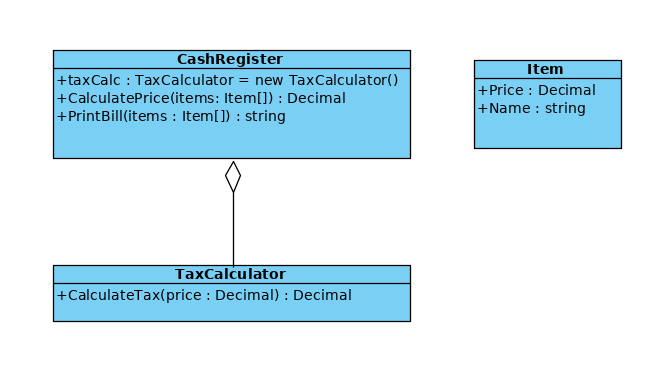
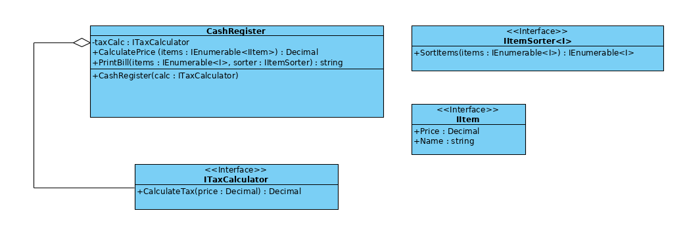

- **Dokonać analizy projektu obiektowego pod katem zgodności klasy CashRegister z zasadą OCP.**

Łatwo można zauważyć, że klasa `CashRegister` narusza OCP, bo nie jest otwarta na rozszerzanie. Korzysta z jednej konkretnej implementacji klasy `TaxCalculator` i nie ma możliwości używania innych sposobów liczenia podatku. To samo tyczy się drukowania paragonów – brakuje wymienności implementacji, gdyż drukowanie jest zaimplementowane bezpośrednio w klasie `CashRegister`. 
Kolejnym problemem może być to, że klient chciałby móc używać swojej własnej implementacji klasy `Item`, więc powinien to być abstrakcyjny interfejs, a nie konkretna klasa.
Podsumowując, projekt jest uzależniony od konkretnej implementacji, nie wykorzystuje polimorfizmu ani nie umożliwia wymienności implementacji.

- **Zaproponować takie zmiany, które uczynią ją niezmienną a równocześnie rozszerzalną jeśli chodzi o możliwość implementowania różnych taryf podatkowych oraz drukowania paragonów z uwzględnieniem różnego porządkowania towarów (alfabetycznie, według kategorii itp.)**

Proponowane zmiany:
1. wprowadzenie interfejsu `ITaxCalculator`, który posiadałby metodę `CalculateTax` aby umożliwić wymienność implementacji liczenia podatku poprzez polimorfizm.
2. wprowadzenie interfejsu `IItem`, który zastąpiłby konkretną klasę `Item`. Pozwala to na wykorzystanie tego samego kodu dla dowolnych rodzajów przedmiotów, które muszą tylko implementować ten interfejs.
3. klasa `CashRegister` powinna mieć konstruktor, który wymagałby  podania odpowiedniego obiektu klasy implementującej interfejs `ITaxCalculator`.
4. dodanie interfejsu `IItemSorter`, który pozwalałby uporządkowywać zadane kolekcje towarów w dowolny sposób. Metoda `PrintBill` powinna przyjmować obiekt klasy z tym interfejsem i uporządkowywać towary przed ich wydrukowaniem.
 

Nowa wersja jest otwarta na rozszerzenia, bo pozwala używać różnych strategii naliczania podatku/drukowania paragonów bez konieczności modyfikacji oryginalnego kodu.

- **Narysować diagramy klas przed i po zmianach.**

Przed:

Po (nie zawiera przykładowych klas implementujących interfejsy):

- **Zaimplementować działający kod dla przykładu przed i po zmianach demonstrując kilka różnych rozszerzeń.**

Kod znajduje się w katalogu `program`. W pliku `After.cs` znajduje się kod po zmianach, w `Before.cs` przed zmianami. W pliku `Example.cs` znajduje się przykład użycia dla obu wersji.