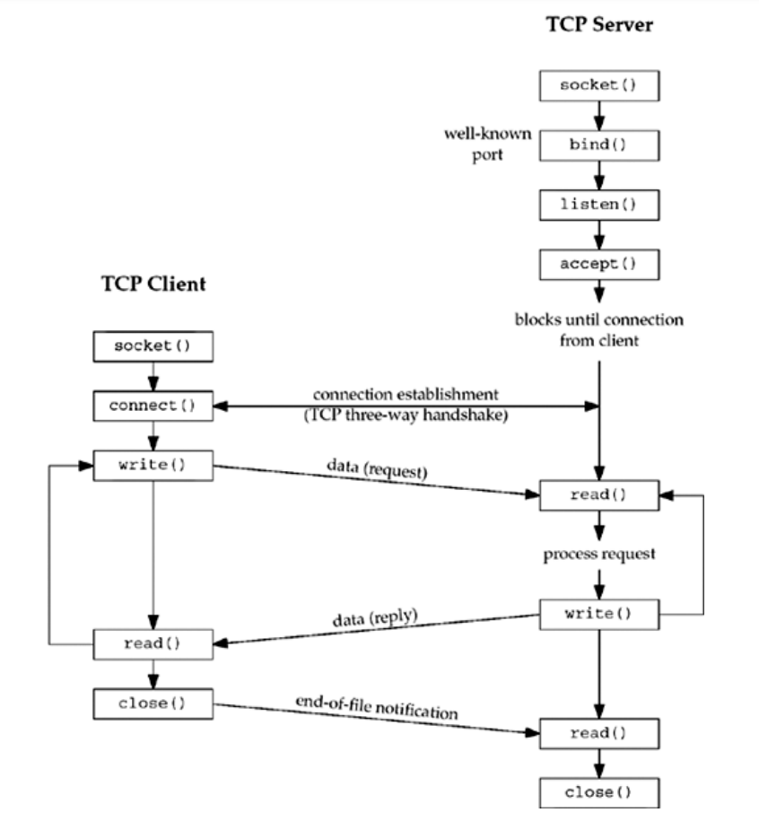
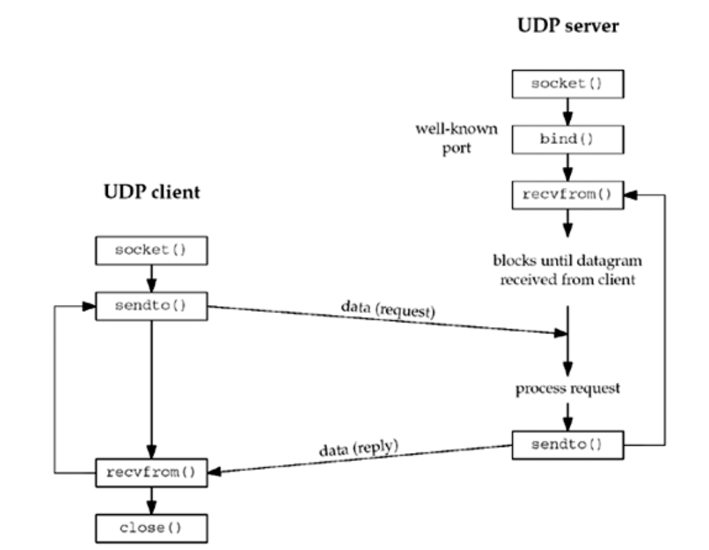

# Spis treści

- [Zadanie 1](#zadanie-1)
- Zadanie 2 (brak)
- Zadanie 3 (brak)
- Zadanie 4 (brak)

***

# Zadanie 1

### Na podstawie §4.1 i §8.1 książki *„Unix Network Programming: The Sockets Networking API”* przedstaw diagram komunikacji klient-serwer za pomocą protokołu TCP i UDP z użyciem, odpowiednio, interfejsu <u>*gniazd strumieniowych*</u> i <u>*datagramowych*</u>.

**gniazda strumieniowe** – gniazda oparte na połączeniach. Umożliwiają sekwencjonowany przepływ danych z gwarancją przesłania pakietu i zachowania kolejności.
**gniazda datagramowe** – gniazda działające bez połączenia. Każdy przsyłany przez nie pakiet jest indywidualnie adresowany i przekierowywany. Nie daje gwarancji przesłania pakietu ani zachowania kolejności.

1) Serwer jest uruchamiany. Tworzy gniazdo i oczekuje na połączenia.
2) Klient jest uruchamiany i próbuje połączyć się z serwerem
3) Klient wysyła żądania do serwera, który mu odpowiada, dopóki klient nie zamknie połączenia.

1) Klient nie tworzy połączenia z serwerem, zamiast tego wysyła datagram do serwera używając funkcji `sendto`, która wymaga docelowego adresu jako parametru.
2) Serwer nie tworzy połączenia z klientem, zamiast tego używa funkcji `recvfrom`, która zwraca protokół klienta razem z datagramem.

###  Która ze stron komunikacji używa <u>*portów ulotnych*</u> (ang. *ephemeral*)?

**porty ulotne** – tymczasowe porty przydzielane automatycznie klientowi. Istnieją tylko na czas trwania połączenia. Po jego zakończeniu port staje się dostępny do ponownego użycia.

Porty ulotne używane są przez klienta.

### Czemu w przypadku protokołu UDP do komunikacji należy używać wywołań systemowych [recvfrom(2)](http://man7.org/linux/man-pages/man2/recvfrom.2.html) i [sendto(2)](http://man7.org/linux/man-pages/man2/sendto.2.html) (o ile wcześniej nie wykonano [connect(2)](http://man7.org/linux/man-pages/man2/connect.2.html)) zamiast [read(2)](http://man7.org/linux/man-pages/man2/read.2.html) i [write(2)](http://man7.org/linux/man-pages/man2/write.2.html)?

Należy używać wywołań `recfrom()` i `sendto()`, gdyż w przypadku protokołu UDP trzeba odczytać z jakiego adresu przyszły pakiety a następnie wysłać je do konkretnego adresu a wywołania `read()` i `write()` tego nie umożliwiają.

***

