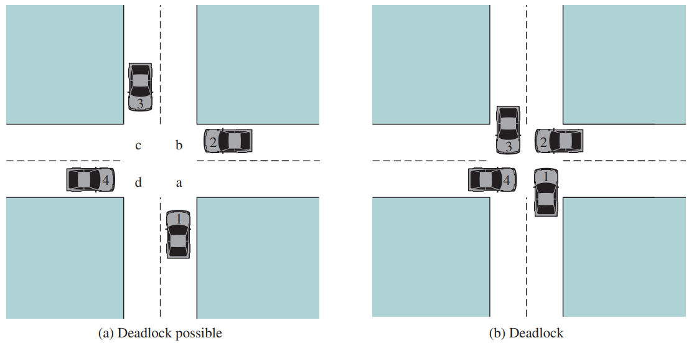
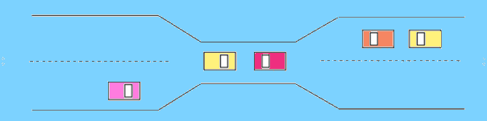
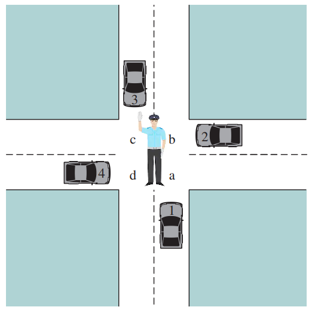

# Spis treści

- [Zadanie 1](#zadanie-1)
- Zadanie 2 – brak
- Zadanie 3 – brak
- Zadanie 4 – brak
- Zadanie 5 (bonus) – brak
- Zadanie 6 – brak
- Zadanie 7 – brak
- Zadanie 8 – brak

***

# Zadanie 1

### Zdefiniuj, w możliwie jak najbardziej formalny sposób, zjawisko <u>*zakleszczenia*</u> (ang. deadlock), <u>*uwięzienia*</u> (ang. *livelock*) i <u>*głodzenia*</u> (ang. *starvation*).

- **zakleszczenie** (ang. *deadlock*) – zbiór procesów jest zakleszczony, jeżeli każdy proces ze zbioru oczekuje na zdarzenie, które może zostać spowodowane jedynie przez inny proces z tego zbioru.
- **uwięzienie** (ang. *livelock*) – dwa procesy są uwięzione, jeżeli każdy z nich oddaje zdobyte blokady gdy nie może zdobyć kolejnej i próbuje od nowa za chwilę, ale oba robią to w tym samym czasie i żaden z nich nie może zdobyć wszystkich.
- **głodzenie** (ang. *starvation*) – proces jest zagłodzony nie otrzymuje dostępu do zasobu, na który oczekuje (np. przez algorytm przydziału tego zasobu).

### Rozważmy ruch uliczny – kiedy na skrzyżowaniach może powstać każde z tych zjawisk? 

- Zakleszczenie

- Uwięzienie – np. dwa samochody próbują się przepuszczać (*Uwaga*: nie skrzyżowanie ale nie mam lepszego przykładu)

- Głodzenie – np. policjant zarządzający ruchem z niewyjaśnionych przyczyn nie daje któremuś samochodowi przejechać

### Zaproponuj metodę (a) <u>*wykrywania i usuwania*</u> zakleszczeń (b) <u>*zapobiegania zakleszczeniom*</u>. Pokaż, że nieudana próba zapobiegania zakleszczeniom może zakończyć się wystąpieniem zjawiska uwięzienia lub głodzenia.

- a) **wykrywanie i usuwanie** zakleszczeń – system nie zapobiega zakleszczeniom, ale zamiast tego pozwala im się wydarzyć, próbuje je wykryć i podjąć kroki w celu rozwiązania problemu.
    - wykrywanie:
        - jeden zasób każdego typu:
            1) Budujemy graf na podstawie stanu systemu
            2) Sprawdź, czy graf zawiera cykl. Jeżeli tak, to procesy w cyklu są zakleszczone.
        - wiele zasobów każdego typu:
            1) Tworzymy macierze alokacji C i żądań R, takich że $C_{ij}$ to liczba zasobów typu $j$ przetrzymywanych przez proces $i$ (analogicznie dla $R$). Wektor $A$ oznacza liczbę dostępnych zasobów każdego typu.
            2) Definiujemy relację $A \leq B$ dla wektorów $A$ i $B$ tak, że zapis ten oznacza, że każdy element z $A$ jest mniejszy lub równy odpowiadającemu mu elementowi z $B$.
            3) Wszystkie procesy na początku są niezaznaczone. Na koniec działania algorytmu nieoznaczone procesy są zakleszczone.
            4) Znajdź nieoznaczony proces $P_i$, dla którego $R_i \leq A$.
            5) Jeżeli taki proces istnieje, dodaj $C_i$ do $A$. Oznacz proces i przejdź do 4.
            6) Jeżeli nie ma takiego procesu, algorytm się kończy.
    - usuwanie:
        - wywłaszczenie procesu i tymczasowe odebranie zasobu i przekazanie innemu procesowi
        - *rollback* – system zapisuje stany procesów w jakichś odstępach czasu do plików (ang. *checkpointing*). Checkpoint przechowuje obraz pamięci oraz stan zasobów. Kiedy deadlock jest wykryty, proces, który przetrzymuje potrzebny zasób może zostać cofnięty do poprzedniego checkpointu.
        - zabicie jednego z procesów, które przetrzymują zasoby
- b) **zapobieganie** zakleszczeniom – system zarządza zasobami w taki sposób, żeby zakleszczenia nie wystąpiły.
    1) usunięcie wzajemnego wykluczania: unikanie przypisywania zasobów procesom, chyba że jest to absolutnie konieczne
    2) eliminacja *Hold-and-Wait Condition*:
        1) wszystkie procesy żądają zasobów przed rozpoczęciem wykonywania – wymaga przewidywania przyszłości
        2) jeżeli zasób jest niedostępny, zwolnij dotychczas pozyskane zasoby
    3) wirtualizacja zasobów, która pozwoli na wywłaszczanie procesów, które je przetrzymują (np. procesy zapisują rzeczy do wydrukowania na dyskua a *deamon* drukarki jako jedyny ma do niej faktyczny dostęp)
    4) eliminacja *Circular Wait Condition*:
        - jeden proces może uzyskać dostęp tylko do jednego zasobu jednocześnie. Jeżeli potrzebuje kolejnego, to musi zwolnić poprzedni (niepraktyczne np. gdy proces ma wysłać skopiować zawartość dysku do drukarki).
        - nadajemy numery zasobom. Procesy mogą uzyskiwać dostęp do zasobów jedynie w kolejności rosnącej względem numerów zasobów (muszą zwolnić wcześniejsze), zapobiega to cyklom w grafie alokacji zasobów.

Nieudana próba zapobiegania może doprowadzić do:
- uwięzienia: 2.1 zwalnianie zasobów w przypadku niemożności uzyskania kolejnego prowadzi do sytuacji gdzie procesy nie są w stanie uzyskać wszystkich zasobów, bo próbują  się „przepuścić”
- głodzenia: 2.2 proces może nigdy nie rozpocząć działania

***

