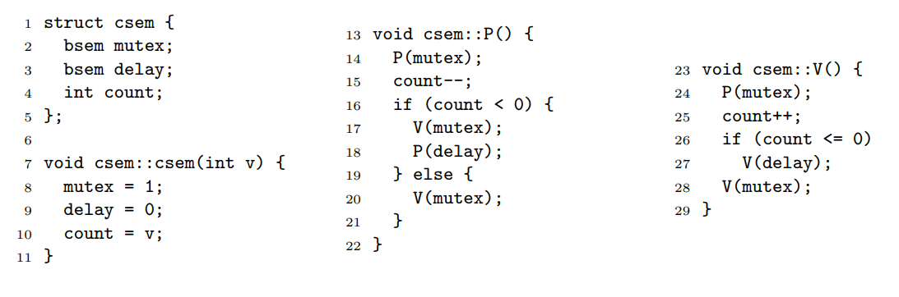
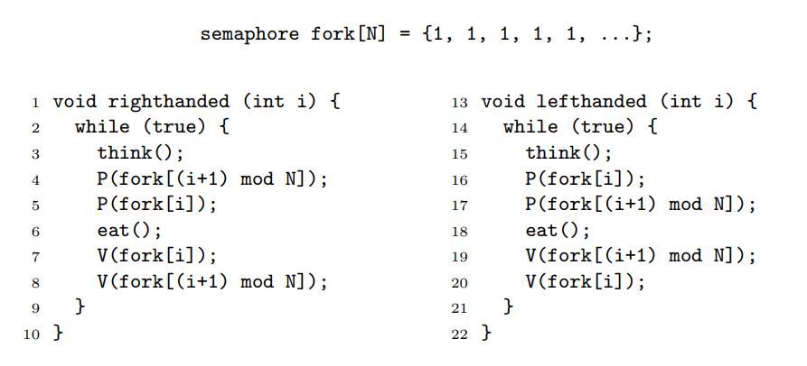

# Spis treści

- [Zadanie 1](#zadanie-1)
- [Zadanie 2](#zadanie-2)
- [Zadanie 3](#zadanie-3)
- [Zadanie 4](#zadanie-4)
- [Zadanie 5](#zadanie-5)

***

# Zadanie 1

### Podaj cztery warunki konieczne do zaistnienia zakleszczenia. 

- *Mutual-Exclusion Condition* – zasoby są przydzielane na wyłączność poszczególnym procesom lub są wolne.
- *Hold-and-wait Condition* – proces przetrzymuje dostęp do co najmniej jednego zasobu i żąda dostępu do kolejnego.
- *No-Preemption Condition* – zasoby mogą być jedynie dobrowolnie zwalniane przez procesy, które mają do nich dostęp i nie można odebrać ich siłą.
- *Circular Wait Condition* – istnieje zacyklony ciąg procesów, taki, że każdy proces przetrzymuje zasób, który jest żądany przez kolejny proces w cyklu.

### Przeczytaj §6.6 oraz §32.3, a następnie wyjaśnij w jaki sposób można <u>*przeciwdziałać zakleszczeniom*</u> (ang. *deadlock prevention*)?

- **zapobieganie zakleszczeniom** – system zarządza zasobami w taki sposób, żeby zakleszczenia nie wystąpiły:
    - eliminacja *Mutual-Exclusion Condition* – unikanie wzajemnego wykluczania i przypisywania zasobów na wyłączność o ile nie jest to absolutnie konieczne. Dostęp do danych, które są tylko do odczytu nadajemy wielu procesom na raz. W przypadku zasobów do pisania, można stosować np. *spooling* – dane wymagające przetworzenia przez urządzenie są umieszczane w buforze na dysku lub w pamięci.
    - eliminacja *Hold-and-wait Condition* – wszystkie procesy żądają wszystkich potrzebnych zasobów przed rozpoczęciem działania lub wszystkie zasoby nabywane są atomowo. Alternatywnie: zwalniamy poprzednie blokady jeżeli nie możemy zdobyć kolejnych.
    - eliminacja *No-Preemption Condition* – wirtualizacja zasobów, która umożłiwa wywłaszczanie procesów w trakcie korzystania z zasobów.
    - eliminacja *Circular Wait Condition* – wprowadzenie zasady, że procesy mają prawo do tylko jednego zasobu jednocześnie. Alternatywnie: numerujemy zasoby. Procesy mogą uzyskiwać dostęp do zasobów o numerach w kolejności rosnącej. Jeżeli chcą inne zasoby, to muszą zwolnić te przetrzymywane.

### Które z proponowanych rozwiązań stosuje się w praktyce i dlaczego? Czemu pozostałe są zbyt kłopotliwe?

- stosowane: 
    - *spooling* (ang.*simultaneous peripheral operations on-line*) w przypadku drukarek
    - *partial lock ordering* (eliminacja *Circular Wait Condition*) przy mapowaniu pamięci w Linuksie.
- kłopotliwe:
    - eliminacja *hold-and-wait*: konieczność znajomości wszystkich zasobów, które będą potrzebne. Zasoby muszą być nabywane wcześnie, zamiast wtedy, gdy są faktycznie potrzebne. W przypadku, gdy zwalniamy wcześniej zdobyte blokady, możemy doprowadzić do *livelock*a.
    – eliminacja *mutual-exclusion*: w przypadku drukarek możliwe jest, że proces, dla którego rozpoczęto drukowanie nie dostarczył jeszcze wszystkich danych do bufora. Jeżeli oczekuje się na wszystkie dane przed rozpoczęciem drukowania, to możlliwe jest przepełnienie bufora.
    - eliminacja *no-preemption*: nie wszystkie zasoby dają się zwirtualizować.

***

# Zadanie 2

### Podaj w pseudokodzie semantykę <u>*instrukcji atomowej*</u> `compare-and-swap` i z jej użyciem zaimplementuj <u>*blokadę wirującą*</u> (ang. *spin lock*) (§28.7). Zakładając, że typ `spin_t` jest równoważny `int`, podaj ciało procedur `void lock(spin_t *)` i `void unlock(spin_t *)`.

**instrukcja atomowa** – instrukcja, która jest niepodzielna i wykonuje się w całości za jednym razem

**blokada wirująca** – blokada polegająca na tym, że wątek, który próbuje uzyskać blokadę czeka w pętli na jej zwolnienie.

```
compare-and-swap(&dest, val, new_val):
    if *dest == val:
        *dest := new_val
        return True
    return False
```

```C
typedef int spin_t;

void lock(spin_t* lock) {
    while (!compare_and_swap(lock, 0, 1));
}

void unlock(spin_t* lock) {
    *lock = 0;
}

```

### Dlaczego użycie blokad wirujących ma sens tylko w oprogramowaniu uruchamianym na maszynach wieloprocesorowych?

Użycie blokad wirujących ma sens tylko na maszynach wieloprocesorowych, gdyż jeżeli mamy do dyspozycji jedynie jeden procesor, to wątek, który próbuje dokonać blokady, marnuje czas procesora w pętli `while`. W przypadku maszyn wieloprocesorowych pętla może być wykonywana równolegle z innym kodem.

###  Podaj główne różnice między blokadami wirującymi, a <u>*blokadami usypiającymi*</u> (§28.14).

**blokady usypiające** – blokady, w ktorych proces oczekujący na blokadę zostaje uśpiony zamiast kręcić się w pętli i używać czasu procesora.

| **wirujące** | **usypiające** |
|--------------|----------------|
| wątek oczekujący na blokadę <br> zużywa czas procesora | wątek oczekujący na blokadę <br>zostaje uśpiony |
| brak przełączania kontekstu | przełączanie kontekstu przy <b4> każdym uśpieniu |
| bardziej użyteczne gdy czasy <br> oczekiwania są krótkie | bardziej użyteczne gdy czas oczekiwania jest długi |
| nie wymaga wywołań systemowych | wymaga wywołań systemowych |

***

# Zadanie 3

### Przeanalizuj poniższy pseudokod wadliwego rozwiązania problemu producent-konsument. Zakładamy, że kolejka `queue` przechowuje do $n$ elementów. Wszystkie operacje na kolejce są <u>*atomowe*</u> (ang. *atomic*). Startujemy po jednym wątku wykonującym kod procedury `producer` i `consumer`. Procedura `sleep` usypia wołający wątek, a `wakeup` budzi wątek wykonujący daną procedurę.

```python
1  def producer():
2      while True:
3          item = produce()
4          if queue.full():
5              sleep()
6          queue.push(item)
7          if not queue.empty():
8              wakeup(consumer)

9  def consumer():
10     while True:
11         if queue.empty():
12             sleep()
13         item = queue.pop()
14         if not queue.full():
15             wakeup(producer)
16         consume(item)
```

operacja **atomowa** – operacja, która jest niepodzielna i zawsze wykona się w całości bez przerywania.

### Wskaż przeplot instrukcji, który doprowadzi do:

### (a) błędu wykonania w linii 6 i 13 

- *6*: `push` do pełnej kolejki:
    - *14*: konsument sprawdza, że kolejka nie jest pełna
    - producent zapełnia kolejkę i dociera do *4* a potem *5*
    - *15*: konsument wybudza producenta
    - *6*: producent próbuje dodać coś do pełnej kolejki
- *13*: `pop` z pustej kolejki:
    - *7*: producent sprawdza, że kolejka nie jest pusta
    - konsument opróżnia kolejkę i dociera do *11* a potem *12*
    - *8*: producent wybudza konsumenta
    - *13*: konsument próbuje usunąć coś z pustej kolejki

### (b) zakleszczenia w liniach 5 i 12.
- *11*: konsument sprawdza, że kolejka jest pusta
- producent wypełnia kolejkę $n$ elementami i dociera do *4* (kolejka jest pełna)
- *12*: konsument zasypia
- *5*: producent zasypia

***

# Zadanie 4

### Poniżej podano błędną implementację semafora zliczającego z użyciem semaforów binarnych. Dopuszczamy, żeby `count` był liczbą ujemną, w takim przypadku jej wartość bezwzględna oznacza liczbę uśpionych procesów. Znajdź kontrprzykład i zaprezentuj wszystkie warunki niezbędne do jego odtworzenia.



Przebieg zdarzeń:

liczba zasobów: 2
procesy: *A*, *B*, *C*, *D*

- `count == 2`
- *A*, *B*, *C*, *D* wywołują `P()`, *C*, *D* zostają wywłaszczone po linijce *17*, *A* i *B* wykonują `P()` do końca. `count == -2`
- *A* wywołuje `V()`, `count == -1`, `delay == 1`
- *B* wywołuje `V()`, `count == 0`, `delay == 1`
- *C* wznawia działanie. `delay == 0`
- *C* wywołuje `V()`. `count == 1`, `delay == 1`
- *D* wznawia działanie. Wywołanie `P(delay)` w linijce *18* nigdy się nie skończy bo `delay == 0` (chyba, że nastąpią dwa wywołania `V()`).

Jest źle, bo `count == 1`. Znaczy to, że jest jeden wolny zasób i zero śpiących procesów a mimo to jeden pozostaje uśpiony.

***

# Zadanie 5

### Poniżej podano jedno z rozwiązań <u>*problemu ucztujących filozofów* </u> Zakładamy, że istnieją tylko leworęczni i praworęczni filozofowie, którzy podnoszą odpowiednio lewą i prawą pałeczkę jako pierwszą. Pałeczki są ponumerowane zgodnie z ruchem wskazówek zegara. Udowodnij, że jakikolwiek układ $n \geq 5$ ucztujących filozofów z co najmniej jednym leworęcznym i praworęcznym zapobiega zakleszczeniom i głodzeniu.



**problem ucztujących filozofów** – pięciu filozofów siedzi dookoła stołu z miskami z jedzeniem. Pomiędzy każdą sąsiednią parą filozofów umieszczona jest pałeczka. Każdy filozof musi na zmianę myśleć i jeść. Do jedzenia potrzebuje obu pałeczek. Problem polega na opracowaniu algorytmu, który zapobiegnie zagłodzeniu i zakleszczeniu filozofów.

<br>

- zapobieganie zakleszczeniu:
    - pokażemy, że zawsze będzie istniał taki filozof, który może jeść. Załóżmy **nie wprost**, że doszło do zakleszczenia. Każda pałeczka, która w tym momencie nie może zostać przez nikogo podniesiona może znajdować się jedynie pomiędzy (kolejno) leworęcznym i praworęcznym filozofem, bo w przeciwnym razie zawsze może zostać podniesiona (P | P, lewy podnosi; L | L, prawy podnosi; P | L, dowolny podnosi; w przypadku L | P pałeczkę może podnieść tylko ten z filozofów, który ma już jedną. Oznacza to, że nieużywana pałeczka pomiędzy L i P może istnieć tylko wtedy, gdy L i P nie mają żadnej pałeczki). Niech K = liczba nieużywanych pałeczek. Wówczas oczywiście jest N-2*K filozofów, którzy nie mają żadnej pałeczki. Wiemy, że K != 0, bo zawsze istnieje para L P, w której jeżeli żaden filozof nie je, to nie może używać pałeczki między nimi. Liczba używanych pałeczek > liczba filozofów używających pałeczki, więc z zasady szufladkowej wynika, że istnieje filozof, który ma dwie pałeczki, czyli je. **Sprzeczność**.
- zapobieganie zagłodzeniu:
    - pokażemy, że każdy filozof będzie miał kiedyś okazję jeść. Niech F będzie dowolnym filozofem, który nie może teraz jeść. Rozpatrzmy przypadki:
        - F jest praworęczny:
            - F trzyma tylko prawą pałeczkę i czeka na lewą. Niech L będzie lewym sąsiadem F. Jeżeli L je, to jak skończy, to odłoży swoją prawą pałeczkę i F będzie mógł jeść. W przeciwnym razie mamy dwa przypadki:
                - L jest leworęczny: wówczas nie ma prawej pałeczki, więc F może ją wziąć i jeść.
                - L jest praworęczny: wówczas trzyma prawą pałeczkę i czeka na lewą. Niech A będzie pierwszym leworęcznym filozofem na lewo od L. Jeżeli A je, to po odłożeniu pałeczki będzie mógł ją wziąć prawy sąsiad A, który po skończeniu przekaże prawą pałeczkę dalej itd. aż do L
                Jeżeli A nie je, to znaczy, że czeka na swoją lewą pałeczkę, czyli prawy sąsiad A może jeść. Kiedy skończy, to odda swoją prawą pałeczkę dalej w prawo.
        - F jest leworęczny: symetrycznie do poprzedniego przypadku
***
