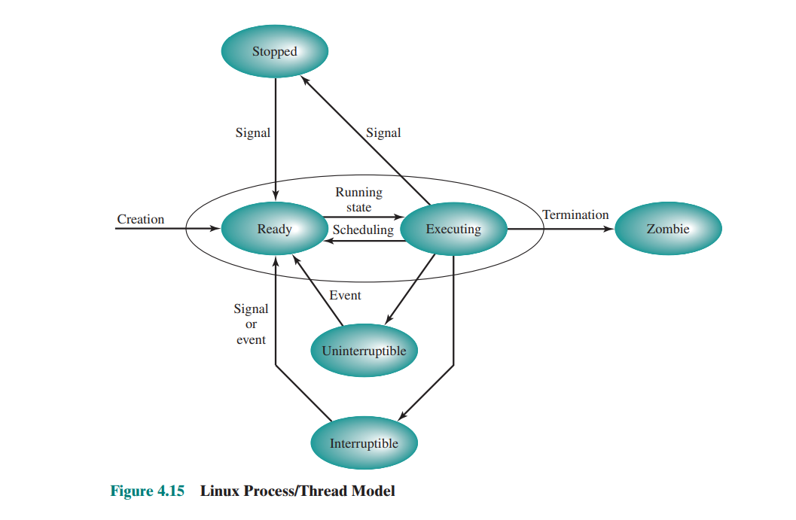
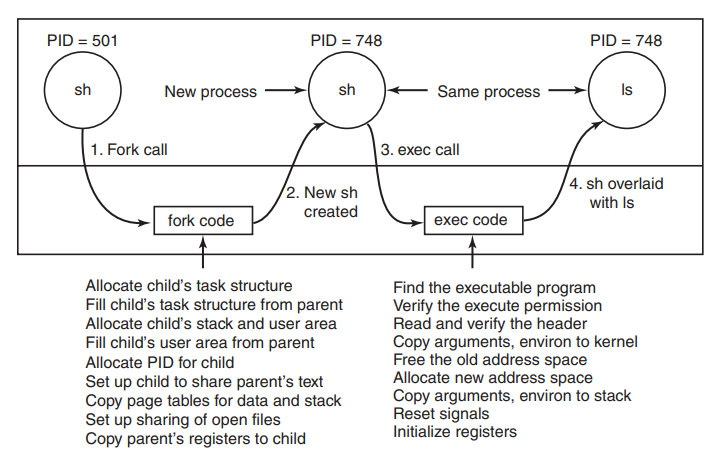

# Zadanie 1

### Na podstawie rysunku przedstaw *stany procesu* w systemie Linux.
- stany procesu:
    - stopped – proces został zatrzymany i może
        zostać wznowiony jedynie przez inny proces
        (na przykład proces może zostać zatrzymywany
        i wznawiany przez debuggera)
    - running 
        - ready – proces został załadowany do pamięci i oczekuje
            na wykonywanie przez procesor.
        - executing – instrukcje procesu są aktualnie
            wykonywane przez procesor.
    - zombie – proces, którego wykonywanie zostało zakończone
        ale dalej znajduje się w tablicy procesów a jego
        zamknięcie nie zostało jeszcze obsłużone przez proces rodzica.
    - interruptible – stan, w którym proces jest zablokowany i czeka
        na zdarzenie takie jak koniec operacji I/O, dostępności
        zasobów bądź sygnał od innego procesu.
    - uninterruptible - stan, w którym proces jest zablokowany ale
        nie obsługuje żadnych sygnałów. (na przykład czeka
        na obsłużenie page fault)

### Podaj akcje albo zdarzenia wyzwalające zmianę stanów. Które przejścia mogą być rezultatem działań podejmowanych przez: jądro systemu operacyjnego, kod sterowników, proces użytkownika?
- Ready <--> Executing:
    - zaplanowanie wykonania procesu przez
    schedulera (działanie podejmowane przez jądro).
- Executing -> Zombie:
    - dobrowolne zakończenie się procesu przez `exit()`.
    - otrzymanie `SIGKILL`a lub `SIGTERM`a
    - zamknięcie przez system w przypadku deadlocka
    - błąd I/O (przez sterownik urządzenia)
- Stopped <--> Ready:
    - otrzymanie sygnału `SIGSTOP` / `SIGCONT` (od procesu użytkownika)
- Interruptible/Uninterruptible --> Ready:
    - wydarzenie I/O (wybudzane przez jądro)
    - sygnał (tylko w przypadku interruptible)
- Executing -> Interruptible/Uninterruptible:
    - żadanie wykonania jakiegoś I/O

### Wyjaśnij różnice między *snem przerywalnym* i *nieprzerywalnym*.
- sen przerywalny (interruptible): proces reaguje na sygnały, przez
    które może zostać obudzony.
- sen nieprzerywalny (uninterruptible): proces nie obsługuje sygnałów, bo
    na przykład śpi podczas wykonywania jakiegoś syscalla, którego
    nie można przerwać sygnałem.

### Czy proces może *zablokować* lub *zignorować* sygnał `SIGKILL`?
- zablokowanie sygnału – system operacyjny nie dostarcza sygnału do
    procesu dopóki nie zostanie on przez niego odblokowany. Proces
    blokuje sygnał poprzez modyfikację swojej maski sygnałów za
    pomocą `sigprocmask()`.
- zignorowanie sygnału - sytuacja, w której nie został zdefiniowany
    handler dla konkretnego sygnału. Zignorowanie sygnału powoduje
    wznowienie wykonania w momencie, w którym otrzymano sygnał.

Nie da się **blokować** `SIGKILL`a. Zignorowanie
tego sygnału powoduje zabicie procesu.

# Zadanie 2

### Wyjaśnij różnice w tworzeniu procesów w systemie Linux(§10.3.3) i WinNT(§11.4.3).

- Linux:
    1. Zostaje utworzony nowy *process descriptor* (`task_struct`) dla
    procesu-dziecka. Większość danych przepisywana jest od rodzica.
    2. Dziecko otrzymuje PID
    3. Tworzona zostaje mapa pamięci i nadawany dzielony
    dostęp do plików rodzica
    4. Rejestry zostają wypełnione odpowiednimi informacjami.

- WinNT

### Naszkicuj przebieg akcji podejmowanych przez jądro w trakcie obsługi funkcji `fork(2)` i `execve(2)`.

Kiedy `fork` zostaje wywołany, kernel tworzy `task_struct` i struktury
danych takie jak *kernel-mode stack* czy `thread_info`. Struktury
te są alokowane w ustalonej odległości od końca stosu procesu i
zawierają różne parametry procesu razem z adresem deskryptora procesu.
Następnie szuka się dostępnego PID i uaktualnia tablicę haszującą 
tak, żeby PID wskazywało na `task_struct`a. Na koniec kopiuje¹ się
pamięć rodzica.

Wywołanie `exec` sprawia, że jądro szuka danego polecenia, kopiuje
argumenty i zmienne środowiskowe i zwalnia starą przestrzeń adresową
i tablicę stron. Tworzona zostaje nowa przestrzeń adresowa ale (w
większości systemów) nie zostaje ona uzupełniona (być może z wyjątkiem
strony dla stosu). Rozpoczęcie wykonywania procesu skutkuje w
*page fault*, który powoduje, że pierwsza strona kodu zostaje
wtoczona z pliku wykonywalnego. W ten sposób nic nie musi zostać
załadowane z wyprzedzeniem przez co programy mogą uruchamiać się
szybko. Na koniec argumenty i zmienne środowiskowe zostają skopiowane
na stos, sygnały zostają zresetowane a rejestry wypełnione zerami.

### Wyjaśnij jak system uniksowy optymalizuje klonowanie procesów z użyciem *kopiowania przy zapisie*¹.

System uniksowy optymalizuje klonowanie procesów poprzez odraczanie
kopiowania pamięci rodzica do momentu, kiedy dziecko próbuje do niej
pisać. Wykorzystuje się **kopiowanie przy zapisie** – nowo utworzony
proces otrzymuje swoją tablicę stron, ale wszystkie oznaczone są
jako *read only*. Kiedy dziecko próbuje pisać do pamięci, następuje
*protection fault*. Jądro w takiej sytuacji alokuje nową kopię
strony dla procesu (*read/write*) i dopiero wtedy kopiuje do niej pamięć.

