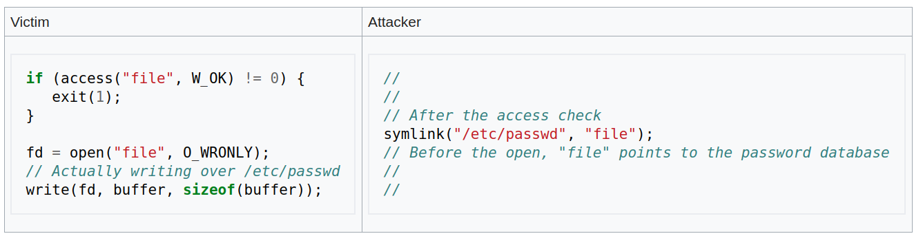

# Spis treści

- [Zadanie 1](#zadanie-1)
- [Zadanie 2](#zadanie-2)
- [Zadanie 3](#zadanie-3)
- [Zadanie 4](#zadanie-4)
- [Zadanie 5](#zadanie-5)
- [Zadanie 6](#zadanie-6)
- [Zadanie 7](#zadanie-7)

***
# Zadanie 1

**obraz procesu** (ang. *process image*) – zawartość pliku wykonywalnego załadowana do pamieci.

### Na podstawie podręcznika [execve(2)](https://www.freebsd.org/cgi/man.cgi?query=execve&sektion=2) wyjaśnij, które zasoby są dziedziczone przez świeżo załadowany program. Co dzieje się z otwartymi plikami i obsługą sygnałów? 

- File descriptors open in the calling process image	remain open in the new process image, except for those for which the close-on-exec flag is set
- Signals set to be ignored in the calling process are set to be ignored in the new process.  Signals which are set to	be caught in the calling process image are set to default action in	the new	process image. Blocked signals remain blocked regardless of changes to the signal	action.
- The new process also inherits the following attributes from the calling process:
    - [process ID](https://www.freebsd.org/cgi/man.cgi?query=getpid&sektion=2&apropos=0&manpath=FreeBSD+12.0-RELEASE+and+Ports)
    - [parent process ID](https://www.freebsd.org/cgi/man.cgi?query=getppid&sektion=2&apropos=0&manpath=FreeBSD+12.0-RELEASE+and+Ports)
    - [process group ID](https://www.freebsd.org/cgi/man.cgi?query=getpgrp&sektion=2&apropos=0&manpath=FreeBSD+12.0-RELEASE+and+Ports)
    - [access groups](https://www.freebsd.org/cgi/man.cgi?query=getgroups&sektion=2&apropos=0&manpath=FreeBSD+12.0-RELEASE+and+Ports)
    - [working directory](https://www.freebsd.org/cgi/man.cgi?query=chdir&sektion=2&apropos=0&manpath=FreeBSD+12.0-RELEASE+and+Ports)
    - [root	directory](https://www.freebsd.org/cgi/man.cgi?query=chroot&sektion=2&apropos=0&manpath=FreeBSD+12.0-RELEASE+and+Ports)
    - [control terminal](https://www.freebsd.org/cgi/man.cgi?query=termios&sektion=4&apropos=0&manpath=FreeBSD+12.0-RELEASE+and+Ports)
    - [resource usages](https://www.freebsd.org/cgi/man.cgi?query=getrusage&sektion=2&apropos=0&manpath=FreeBSD+12.0-RELEASE+and+Ports)
    - [interval timers](https://www.freebsd.org/cgi/man.cgi?query=getitimer&sektion=2&apropos=0&manpath=FreeBSD+12.0-RELEASE+and+Ports)
    - [resource limits](https://www.freebsd.org/cgi/man.cgi?query=getrlimit&sektion=2&apropos=0&manpath=FreeBSD+12.0-RELEASE+and+Ports)
    - [file	mode mask](https://www.freebsd.org/cgi/man.cgi?query=umask&sektion=2&apropos=0&manpath=FreeBSD+12.0-RELEASE+and+Ports)
    - [signal mask](https://www.freebsd.org/cgi/man.cgi?query=sigaction&sektion=2&apropos=0&manpath=FreeBSD+12.0-RELEASE+and+Ports)

### Znajdź w katalogu `/bin` lub `/usr/bin` pliki wykonywalne z ustawionym *bitem uprawnień* `set-uid` lub `set-gid`. Do czego służą te bity?

**bit uprawnień** - bit oznaczający jakie uprawnienia (odczyt/zapisywanie/wykonywanie) ma właściciel pliku/członkowie grupy/inni użytkownicy. Bity uprawnień mają format `tuuugggooo` (t – typ pliku, u - właściciel, g – grupa, o - pozostali) gdzie w każdej z trzech kategorii znajdują się trzy bity `rwx` (read/write/execute).

Polecenie:
```bash
ls -al /usr/bin | grep "[r|\-][w|\-]s"
```

`set-uid`/`set-gid` - bit oznaczający, że użytkownik uruchamiający program uruchamia go z uprawnieniami jego właściciela/grupy właściciela (np. `sudo`).

# Zadanie 2

### Wywołanie [open(2)](https://www.freebsd.org/cgi/man.cgi?query=open&sektion=2) zawiedzie z błędem `ETXTBSY`, jeśli próbujemy otworzyć plik wykonywalny do zapisu pod warunkiem, że tenże plik jest w chwili obecnej wykonywany. Co mogłoby się stać, gdyby system operacyjny pozwolił modyfikować plik wykonywalny, który jest uruchomiony?

Jeżeli system używa stronicowania na żądanie, to wówczas kopiuje stronę z dysku do pamięci wtedy, gdy następuje próba dostępu do niej. Gdyby system pozwalał modyfikować uruchomione pliki wykonywalne, to wówczas istnieje możliwość, że dokonałby modyfikacji fragmentu tego pliku, który znajdowałby się na stronie niezaładowanej jeszcze do pamięci przez co przy próbie wykonania tego fragmentu mógłby zostać wykonany zmodyfikowany kod.

# Zadanie 3

### Które z operacji wymienionych w *§39* działają na katalogach?

(może trochę więcej oprócz tych)
- **mkdir**
- **rmdir**
- **closedir**
- **opendir**
- **readdir**
- **chmod**

### Na podstawie *§10.6.3* (rysunek10-32) przedstaw reprezentację katalogu i pokaż jak przebiega operacja usuwania pliku.


**Reprezentacja katalogu**:
Katalog (w *ext2*) pozwala na nazwy plików do 255 znaków. Każdy katalog składa się z całkowitej liczby bloków co pozwala na jego atomowy zapis na dysku. Wewnątrz katalogu znajdują się nieposortowane wpisy plików i katalogów. Jeżeli któryś nie zajmuje całego bloku to wówczas bajty na jego końcu są nieużywane. 
Każdy wpis w katalogu składa się z czterech pół stałej długości i jednego o zmiennej. Pierwsze pole oznacza numer *inode* pliku. Następny, `rec_len` oznacza jak duży jest wpis (w bajtach, włączając ewentualny *padding* na końcu). Pole to jest potrzebne do znajdowania kolejnego wpisu. Następne pole oznacza typ pliku (plik, katalog itd.). Ostatnie pole o stałym rozmiarze mówi o tym jak długa jest nazwa pliku. Nazwa pliku jest *null terminated* i wyrównana do 32 bitów.

**Usuwanie pliku**:

Usuwanie pliku polega na zwiększeniu rozmiaru wpisu poprzedzającego usuwany wpis. Miejsce zajmowane przez usuwany wpis jest traktowane jako nieużywana część poprzedniego wpisu.

### Wpis katalogu nie zawiera *metadanych* pliku – gdzie w takim razie są one składowane?

Metadane składowane są w *inode*'ach.

**metadane** (pliku) - lista atrybutów pliku zawierająca informacje o nim. Np. na linuxie:
```c
/* Metadata returned by the stat and fstat functions */
struct stat 
{
    dev_t st_dev; /* Device */
    ino_t st_ino; /* inode */
    mode_t st_mode; /* Protection and file type */
    nlink_t st_nlink; /* Number of hard links */
    uid_t st_uid; /* User ID of owner */
    gid_t st_gid; /* Group ID of owner */
    dev_t st_rdev; /* Device type (if inode device) */
    off_t st_size; /* Total size, in bytes */
    unsigned long st_blksize; /* Blocksize for filesystem I/O */
    unsigned long st_blocks; /* Number of blocks allocated */
    time_t st_atime; /* Time of last access */
    time_t st_mtime; /* Time of last modification */
    time_t st_ctime; /* Time of last change */
};
```

###  Co wyraża pole `st_nlink` struktury `statbuf` opisanej w [stat(2)](http://man7.org/linux/man-pages/man2/stat.2.html)?

`st_nlink` oznacza liczbę dowiązań twardych (ang. *hard link*) do pliku. Licznik ten zlicza ile katalogów ma wpis dla tego pliku. Linki symboliczne nie wliczają się do tej sumy. *If the count is ever decremented to zero, then the file itself is discarded as soon as no process still holds it open.*

### Kiedy plik zostaje faktycznie usunięty z dysku?

Plik zostaje faktycznie usunięty z dysku kiedy licznik `st_nlink` będzie miał wartość zero (czyli nie istnieje żaden link do tego pliku).

# Zadanie 4

### Jaką rolę pełnią bity uprawnień `rwx` dla katalogów w systemach uniksowych? 

- **r** – prawo do odczytywania listy plików znajdujących się w katalogu.
- **w** – prawo do modyfikowania listy plików (usuwanie, zmiana nazw, dodawanie) w katalogu pod warunkiem, że bit **x** również jest ustawiony.
- **x** - pozwala na ustawienie katalogu jako katalogu roboczego.

### Opisz znaczenie bitów `set-uid`, `set-gid` i `sticky` dla katalogów. 

- `set-gid` – ustawienie tego bitu dla katalogu sprawia, że wszystkie nowe pliki i podkatalogi utworzone wewnątrz tego katalogu dziedziczą *gid* tego katalogu zamiast ID głównej grupy użytkownika, który utworzył plik (nie dotyczy ID właściciela, jedynie grupy). Nowo utworzone podkatalogi dziedziczą bit `set-gid`. Nie dotyczy *gid* plików które zostały utworzone gdzie indziej i przeniesione do katalogu z ustawionym `set-gid`.
- `set-uid` – na większości systemów jest ignorowany ale na FreeBSD `set-uid` interpretowany jest podobnie jak `set-gid`, tylko że dotyczy właściciela a nie grupy.
- `sticky` – w katalogu z ustawionym bitem `sticky` pliki mogą być usuwane lub przemianowywane tylko przez właściciela lub *root*a. W przeciwnym razie każdy użytkownik z prawami zapisu i wykonywania dla katalogu mógłby usuwać bądź przemianowywać znajdujące się w nim pliki.

### Zaprezentuj pseudokod procedury `bool my_access(struct stat *statbuf, int mode)`.

```C
#define SIZE 32

bool my_access(struct stat* statbuf, int mode)
{
    // uprawnienia które nas interesują
    const int rwx = ((mode & R_OK != 0) << 2)
                  | ((mode & W_OK != 0) << 1)
                  |  (mode & X_OK != 0);

    if (statbuf->st_uid == getuid())
        return (((statbuf->st_mode >> 6) & rwx) ^ rwx) == 0;
    //          |_____________________________| |
    //            interesujące nas uprawnienia, |_ jeżeli brakuje uprawnienia
    //            które znajdują się w masce       to wówczas wynik xor będzie
    //            st_mode                          niezerowy

    gid_t gids[SIZE];
    const int gids_count = getgroups(SIZE, gids);
    // tutaj powinna być obsługa błędu wywołania getgroups
    for (int i = 0; i < gids_count; i++)
    {
        if (gids[i] == statbuf->st_gid)
            return (((statbuf->st_mode >> 3) & rwx) ^ rwx) == 0;
    }

    return ((statbuf->st_mode & rwx) ^ rwx) == 0;
}
```

# Zadanie 5

### Zlokalizuj w poniższym kodzie wyścig i napraw go! 

W czasie pomiędzy wywołaniem `access(...)` oraz `Open(...)` inny proces może otworzyć plik, przez co dwa procesy otrzymają blokadę (z `O_CREAT` open nie sprawdza, czy plik istnieje).

Poprawka:

```C
#include "csapp.h

bool f_lock(const char* path)
{
    return Open(path, O_CREAT | O_EXCL | O_WRONLY, 0700) >= 0;
}

void f_unlock(const char* path)
{
    Unlink(path);
}

```

### Opowiedz jakie zagrożenia niesie ze sobą taki błąd

Błędy **TOCTTOU** (*Time Of Check To Time Of Use*) umożliwiają atakującemu ominięcie sprawdzenia poprawności operacji przez celową zmianę danych w momencie gdy program znajduje się pomiędzy ich sprawdzeniem a wykonaniem operacji.

Przykład: Usługa poczty elektronicznej działająca jako *root*, która dodaje nadchodzące wiadomości do pliku skrzynki odbiorczej użytkownika poprzez wywołanie `lstat()` w celu uzyskania informacji o tym, czy jest to normalny plik, którego właścicielem jest użytkownik (a nie na link do innego pliku, którego serwer nie powinien uaktualniać) a następnie, jeżeli test się powiedzie, aktualizuje plik z nowymi wiadomościami. Przerwa pomiędzy sprawdzeniem a zapisem do pliku może jednak zostać wykorzystana przez atakującego, który może podmienić swoją skrzynkę odbiorczą na inny plik, np `/etc/passwd` (*przyp.red:* w `/etc/passwd` haseł już w dzisiejszych czasach nie ma). Jeżeli zmiana nastąpi w idealnym momencie, to atakujący mógłby zapisać coś do wrażliwego pliku (np. dodać konto z uprawnieniami *root*a).



# Zadanie 6

**kursor** – aktualne przesunięcie względem początku pliku; miejsce od którego następuje wczytywanie/zapis.

# Zadanie 7

[metadane](#zadanie-3)

### Uruchom program `mkholes`, a następnie odczytaj metadane pliku `holes.bin` przy pomocy polecenia [stat(1)](http://man7.org/linux/man-pages/man1/stat.1.html). Wszystkie pola struktury `stat` są opisane w [stat(2)](http://man7.org/linux/man-pages/man2/stat.2.html). Oblicz faktyczną objętość pliku na podstawie liczby używanych bloków `st_blocks` i rozmiaru pojedynczego bloku `st_blksize` systemu pliku. 

```bash
stat holes.bin
# out:
    File: holes.bin
    Size: 33550336  	Blocks: 1112       IO Block: 4096   regular file
    Device: 807h/2055d	Inode: 12322952    Links: 1
    Access: (0644/-rw-r--r--)  Uid: ( 1000/jgrobelny)   Gid: ( 1000/jgrobelny)
    Access: 2019-11-05 00:20:39.601578315 +0100
    Modify: 2019-11-05 00:28:02.432897339 +0100
    Change: 2019-11-05 00:28:02.432897339 +0100
    Birth: 2019-11-05 00:20:39.601578315 +0100

stat -c=%B holes.bin
512
```

Faktyczna objętość pliku = Blocks * 512

### Czemu liczba używanych bloków jest mniejsza od tej wynikającej z objętości pliku z pola `st_size`?

Liczba bloków wynikająca z Size = Size / 512 

Liczba bloków jest mniejsza niż wynikająca z objętości pliku, gdyż program `mkholes` pisze jedynie do ~1/64 bloków a w pozostałych przypadkach jedynie przesuwa kursor tworząc dziury.

### Czemu jest większa od liczby faktycznie używanych bloków zgłaszanych przez `mkholes`?

Bo faktyczny rozmiar bloku jest inny niż stała zadeklarowana w programie.
