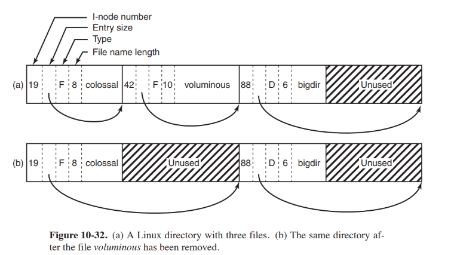
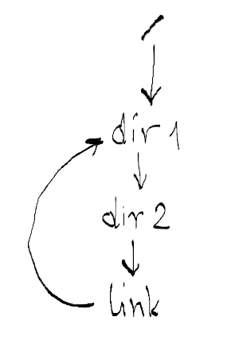
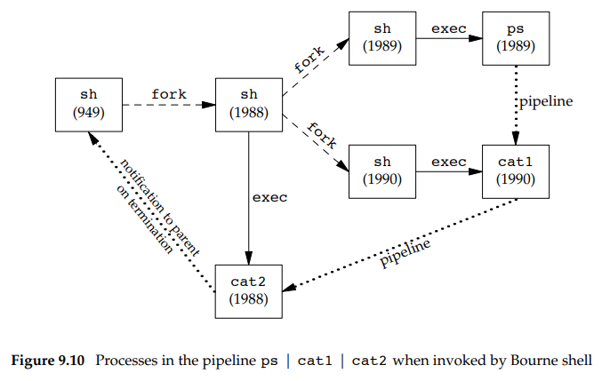

# Spis treści

- [Zadanie 1](#zadanie-1)
- [Zadanie 2](#zadanie-2)
- [Zadanie 3](#zadanie-3)
- [Zadanie 4](#zadanie-4)
- Zadanie 5 – brak
- [Zadanie 6](#zadanie-6)
- [Zadanie 7](#zadanie-7)
- [Zadanie 8](#zadanie-8)

***

# Zadanie 1

### Czym różnią się ścieżka *absolutna*, *relatywna* i *znormalizowan*a?

- **ścieżka absolutna** – wskazuje na ten sam plik niezależnie od aktualnego katalogu roboczego (zaczyna się katalogiem *root*a).
- **ścieżka relatywna** – wskazuje na lokalizację względem aktualnego katalogu roboczego.
- **ścieżka znormalizowana** – ścieżka bez `..` i `.`.

### Względem którego katalogu obliczana jest ścieżka relatywna? Jakim wywołaniem systemowym zmienić ten katalog?

Ścieżka relatywna obliczana jest względem aktualnego katalogu roboczego (*current working directory*).

Można zmienić ten katalog wywołąniem [chdir(2)](https://linux.die.net/man/2/chdir).

### Wyjaśnij czym są *punkty montażowe*, a następnie na podstawie [mount(8)](https://www.freebsd.org/cgi/man.cgi?mount(8)) wyjaśnij znaczenie i zastosowanie następujących atrybutów punktów montażowych: `noatime`, `noexec` i `sync`.

**punkt montażowy** (ang. *mount point*) – katalog w systemie plików do którego logicznie dołączony (*logically attached*) jest dodatkowy system plików (np. z innego urządzenia). Punkt montażowy staje się *root directory* nowo dodanego systemu plików i umożliwia do niego dostęp.


- `noatime` – powoduje, że czasy dostępów do *inode*'ów nie są aktualizowane w danym systemie plików (na przykład w celu zwiększenia szybkości dostępu gdy plików jest dużo).
- `noexec` – zakaz bezpośredniego wykonywania plików binarnych ze wskazanego zamontowanego systemu plików (nie dotyczy plików tekstowych ze skryptami z *shebang*iem). Ta opcja jest przydatna dla serwerów, które mają systemy plików zawierające pliki wykonywalne dla architektur innych niż własna.
- `sync` – powoduje, że wszelkie operacje I/O do systemu plików muszą zostać wykonane synchronicznie. Może skrócić życie urządzeń z ograniczoną liczbą zapisów ale zapewnia spójność zapisywanych danych.

***

# Zadanie 2

### Przywołując strukturę `dirent` i reprezentację katalogu z poprzednich ćwiczeń wyjaśnij krok po kroku jak działa [rename(2)](http://man7.org/linux/man-pages/man2/rename.2.html). 

Struktura dirent:
```C
struct dirent 
{
    ino_t          d_ino;       /* Inode number */
    off_t          d_off;       /* Not an offset; see below */
    unsigned short d_reclen;    /* Length of this record */
    unsigned char  d_type;      /* Type of file; not supported by all filesystem types */
    char           d_name[256]; /* Null-terminated filename */
};
```

Reprezentacja katalogu z poprzednich ćwiczeń:


Działanie `int rename(const char* oldname, const char* newname)`:
1. Jeżeli `oldname` i `newname` nie są katalogami oraz `newname` istnieje, to wówczas `newname` zostaje usunięty a `oldname` przemianowany na `newname`. Wymagane są uprawnienia do pisania w katalogu zawierającym `oldname` i `newname`.
2. Jeżeli `oldname` jest katalogiem i `newname` jest katalogiem, to `newname` musi być pusym katalogiem. Jeżeli `newname` istnieje to zostaje usunięty a `oldname` przemianowany na `newname`. Dodatkowo jeżeli przemianowujemy katalog, to `newname` nie może zawierać prefiksu, który nazywa `oldname`. Na przykład nie można przemianować `/usr/foo` na `/usr/foo/testdir` bo trzeba by usunąć usunąć `/usr/foo`.
3. Jeżeli `oldname` bądź `newname` odnosi się do dowiązania symbolicznego, wówczas przetwarzane jest dowiązanie a nie plik, na który wskazuje.
4. Nie można przemianować `.` ani `..`.
5. Jeżeli `oldname` i `newname` odnoszą się do tego samego pliku, to funkcja kończy się sukcesem bez zmieniania niczego.
- Jeżeli `newname` istnieje, musimy mieć pozwolenia jak gdybyśmy go usuwali. Dodatkowo, prez to że usuwamy wpis w katalogu dla `oldname` i być może tworzymy nowe wpis dla `newname`, potrzebujemy uprawnień *write* i *execute* w katalogach zawierającym `oldname` i `newname`.

### Zauważ, że korzystając z `rename` można również przenieść *atomowo* plik do innego katalogu pod warunkiem, że ten znajduje się w obrębie tego samego systemu plików.

- **atomowo** – za pomocą jednej operacji, która nie może się przeplatać z żadną inną.

### Czemu `rename` zakończy się błędem `EXDEV` kiedy próbujemy przenieść plik do innego systemu plików?

Ponieważ nie da się atomowo przenosić plików pomiędzy różnymi systemami plików a wywołanie `rename` jest atomowe. Żeby przenieść taki plik `mv` robi *copy* i *delete* w przestrzeni użytkownika.

***

# Zadanie 3

### Na podstawie slajdów do wykładu wyjaśnij różnice w sposobie implementacji dowiązań *twardych* (ang. hard link) i *symbolicznych* (ang. symbolic link).

- **dowiązanie twarde** – wskaźniki na *inode*'y plików. Wliczają się do licznika referencji do pliku.

- **dowiązanie symboliczne** – kodują ścieżkę, do której należy pzrekierować algorytm rozwiązywania nazw.

### Jak za pomocą dowiązania symbolicznego stworzyć w systemie plików pętlę? 

```bash
ln -s . link
```
lub
```bash
mkdir dir

cd dir

ln -s ../dir link
```
(*Ciekawostka: po 40 `cd link` następuje powrót do początkowego katalogu*)


### Kiedy jądro systemu operacyjnego ją wykryje (błąd `ELOOP`)?

Jądro wykrywa pętlę jeżeli przekroczona zostaje maksymalna głębokość rekursji (*"Too many levels of symbolic links"*).

### Czemu pętli nie da się zrobić z użyciem dowiązania twardego? 

Możliwość stworzenia pętli z użyciem dowiązań twardych sprawiłoby, że mogłyby powstać spójne składowe DAGu, które nie byłyby osiągalne z katalogu *root*.



W przypadku na obrazku usunięcie dowiązania z `/` sprawiłoby, że `dir1` byłoby nieosiągalne ale nie zostałoby usunięte, gdyż istniałaby referencja z `link`.

### Skąd wynika liczba dowiązań do katalogów?

Liczba dowiązań wynika z liczby podkatalogów (każdy z nich ma dowiązanie `..`), z dowiązania `.` oraz wszystkich pozostałych dowiązań twardych (w szczególności dowiązania od rodzica).

****

# Zadanie 4

### Do czego służy wywołanie systemowe [ioctl(2)](http://man7.org/linux/man-pages/man2/ioctl.2.html)? Zauważ, że stosowane jest głównie do plików urządzeń znakowych lub blokowych.

Wywołanie `ioctl()` (*input/output control*) - wywołanie systemowe do specyficznych dla danego urządzenia operacji IO i innych operacji, których nie można wyrazić zwykłymi wywołaniami systemowymi.

### Na podstawie pliku [ioccom.h](https://grok.dragonflybsd.org/xref/netbsd/sys/sys/ioccom.h) wyjaśnij znaczenie drugiego i trzeciego parametru wywołania [ioctl(2)](http://man7.org/linux/man-pages/man2/ioctl.2.html).

- drugi parametr – kod rządanej operacji. Koduje informację o tym, czy argument jest parametrem wejściowym czy wyjściowym i rozmiar kolejnego argumentu w bajtach.
```
    31 29 28                     16 15            8 7             0
   +---------------------------------------------------------------+
   | I/O | Parameter Length        | Command Group | Command       |
   +---------------------------------------------------------------+
```
- trzeci parametr – nietypowany wskaźnik do pamięci.

### Używając [przeglądarki kodu](https://grok.dragonflybsd.org/xref/netbsd/) jądra NetBSD znajdź definicję identyfikatorów `DIOCEJECT`, `KIOCTYPE` i `SIOCGIFCONF`, a następnie krótko opisz co robią te polecenia.

- `DIOCEJECT` – *„eject removable disk”*
- `KIOCTYPE` – *„get keyboard type”*
- `SIOCGIFCONF` –  *„get [ifnet](https://www.freebsd.org/cgi/man.cgi?query=ifnet&sektion=9) list”*

***

# Zadanie 6

### Uruchamiamy w powłoce *potok* (ang. pipeline) `ps -ef | grep zsh | wc -l > cnt`, Każde z poleceń używa wyłącznie standardowego wejścia i wyjścia. Dzięki [dup2(2)](http://man7.org/linux/man-pages/man2/dup2.2.html) i [pipe(2)](http://man7.org/linux/man-pages/man2/pipe.2.html) bez modyfikacji kodu źródłowego powyższych programów możemy połączyć je w potok i *przekierować* wyjście do pliku `cnt`. Powłoka umieszcza wszystkie trzy procesy w nowej grupie procesów rozłącznej z grupą powłoki. Kiedy potok zakończy swe działanie, do powłoki zostanie przekazany kod wyjścia ostatniego polecenia w potoku

- **potok** – mechanizm komunikacji międzyprocesowej polegający na połączeniu procesów poprzez ich standardowe strumienie wejścia/wyjścia przez co kolejne procesy otrzymują wyjście poprzednich jako wejście.
- **przekierowanie** – zmiana standardowego wejścią bądź wyjścia procesu na inny plik.

### Uzasadnij kolejność tworzenia procesów potoku posługując się obrazem 9.10 z rozdziału *„Shell Execution of Programs”* (APUE). Następnie ustal, który z procesów powinien wołać [setpgrp(2)](http://man7.org/linux/man-pages/man2/setpgrp.2.html), [creat(2)](http://man7.org/linux/man-pages/man2/creat.2.html), [dup2(2)](http://man7.org/linux/man-pages/man2/dup2.2.html), [pipe(2)](http://man7.org/linux/man-pages/man2/pipe.2.html), [close(2)](http://man7.org/linux/man-pages/man2/close.2.html) lub [waitpid(2)](http://man7.org/linux/man-pages/man2/close.2.html) i uzasadnij swój wybór.

Wynik `ps | cat1 | cat2`:



- Kolejność tworzenia procesów potoku: ostatni proces w potoku jest dzieckiem powłoki i wszystkie inne procesy są dziećmi ostatniego procesu.
    - Uzasadnienie:
        - przez to, że ostatni proces jest dzieckiem powłoki, powłoka ma    dostep do informacji, że cały potok się zakończył.

(***Uwaga!*** *mój autorski pomysł więc prawdopodobnie jest zły* **Uwaga!**)
- Który z procesów powinien wywołać...
    - `setpgrp()`: 1988 jeżeli chcemy żeby cały potok był osobną grupą.
    - `creat()`: żaden ???
    - `dup2()`: 1998 do zmiany stdin, 1989 i 1990 do ustawienia wejścia *pipe*'a jako swojego `stdout`.
    - `pipe()`: 1998 – powinien tworzyć *pipe*'y w pętli. Powinien ustawiać kolejne wyjścia *pipe*'ów jako swój `stdin` używając `dup2` (i `fork`iem tworzyć dzieci, które odziedziczą ten *pipe*).
    - `close()`: 1988, 1989, 1990 do zamknięcia nieużywanych końców *pipe*'ów.
    - `waitpid()`: 949 (shell).


Ogólny schemat:
- w [1989] ustaw *id* grupy przy użyciu `setpgrp`.
- w [1989] dla każdego polecenia poza ostatnim w potoku (od lewej):
    - wywołaj `pipe`
    - wywołaj `fork`
        - w dziecku:
            - ustaw wejście *pipe*'a jako swój `stdout` przy użyciu `dup2`.
            - zamknij wyjście *pipe*'a przy użyciu `close`.
            - wywołaj odpowiednie polecenie przy użyciu `exec`.
        - w rodzicu ([1989]):
            - ustaw wyjście *pipe*'a jako swój `stdin` przy użyciu `dup2`.
            - zamknij wejście *pipe*'a przy użyciu `close`.
- wywołaj ostatnie polecenie z potoku przy użyciu `exec`.

(*teoretycznie na końcu [1989] będzie miał wyjście ostatniego pipe'a jako swój stdin a stdin pierwszego procesu będzie niezmieniony tak jak stdout ostatniego*)

***

# Zadanie 7

Rozwiązanie:
- [prime.c](programy/prime.c)

***

# Zadanie 8

- **zmiana kontekstu** – zapisanie stanu procesu aby można było go przywrócić potem i wczytanie innego zapisanego stanu.

- **wielozadaniowość kooperacyjna** (ang. *cooperative multitasking*) – inaczej *non-preemptive multitasking*. Styl wielozadaniowości, w którym system operacyjny nigdy nie wykonuje zmiany kontekstu pomiędzy procesami. Zamiast tego procesy dobrowolnie zrzekają się (ang. *yield*) kontroli aby umożliwić innym zadaniom współbieżne działanie.

Rozwiązanie:
- [coro.c](programy/coro.c)
- [Setjmp.s z komentarzami](programy/libcsapp/Setjmp.s)
