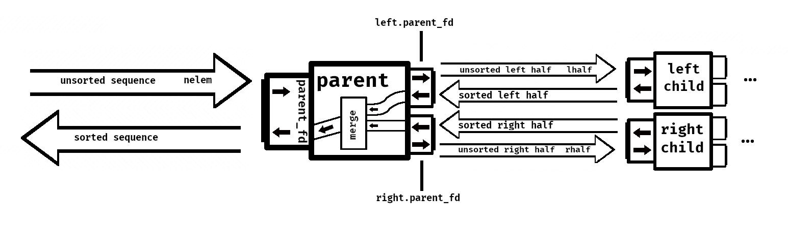

# Spis treści

**Uwaga**: w tym tygodniu mogę nie mieć zbyt wielu rozwiązań bo muszę zrobić prezentację na seminarium *xd*

- [Zadanie 1](#zadanie-1)
- Zadanie 2 – brak
- [Zadanie 3](#zadanie-3)
- [Zadanie 4](#zadanie-4)
- [Zadanie 5](#zadanie-5)

***

# Zadanie 1

### Przeczytaj krytykę kluczowej idei systemu Unix, tj. [A Unix File Is Just a Big Bag of Bytes](http://www.catb.org/~esr/writings/taoup/html/ch20s03.html#id3015538). Na podstawie [Resource Fork](https://en.wikipedia.org/wiki/Resource_fork) wyjaśnij czym były dodatkowe zasoby pliku w historycznych systemach *MacOS*.

**resource fork** – dodatkowe, dane powiązane z obiektem z systemu plików używane do przechowywania ustrukturyzowanych danych razem z nieustrukturyzowanymi danymi przechowywanymi w *data fork*u . **Resource fork** przechowuje informacje w specyficznych formie, zawierając detale takie jak ikony, kształty okienek, definicje menu i ich zawartości bądź kod aplikacji. Na przykład dokument może przechowywać tekst w *data fork*u, podczas gdy obrazki będą przechowywane w *resource fork*u tego samego pliku.

W HFS (*Hierarchical File System*) **resource forki** miały trzy zastosowania:
- były używane do przechowywania wszelkich graficznych danychna dysku aż nie były one potrzebne. Potem można było jewczytać, narysować i od razu wyrzucić. Pomagało tozredukować wymaganą pamięć.
- przez przechowywanie obrazków i tekstu osobno, nie-programiści mogli tłumaczyć aplikacje na obce języki
- umożliwiały dystrybucję niemal wszystkich komponentów aplikacji w pojedynczym pliku

*Resource fork* sprawiał, że łatwo było przechowywać dodatkowe informacje, na przykład pozwalające systemowi na wyświetlenie poprawnej ikony dla pliku i otworzenie go bez potrzeby istnienia rozszerzenia pliku w jego nazwie.

Dostęp do *resource fork*ów działał bardziej jak wydobywanie ustrukturyzowanych rekordów z bazy danych.

*Resource fork*i były czasami używane do przechowywania metadanych.

### Jaką postać mają rozszerzone atrybuty pliku [xattr(7)](http://man7.org/linux/man-pages/man7/xattr.7.html)?

**rozszerzone atrybuty pliku** – rozszerzenia zwykłych atrybutów, które są powiązane ze wszystkimi *inode*'ami w systemie. Są często używane do dostarczenia dodatkowej funkcjonalności systemu plików, na przykład [*Access Control Lists*](https://en.wikipedia.org/wiki/Access-control_list) dla zwiększenia bezpieczeństwa.

Rozszerzone atrybuty pliku są w postaci par `nazwa:wartość` powiązanych trwale z plikami i katalogami, podobnie do *environment string*ów powiązanych z procesami. Nazwy atrybutów są *null-terminated*. Nazwa atrybutu jest zawsze podana z uwzględnieniem całej przestrzeni nazw do której należy (`namespace.attribute`). Atrybut może być albo zdefiniowany, albo niezdefiniowany. Jeżeli jest zdefiniowany, jego wartość może być pusta bądź niepusta.

Dostęp do rozszerzonych atrybutów jest jak do atomowych obiektów. `getxattr(2)` odczytuje całą wartość atrybutu a `setxattr(2)` zamienia poprzednią wartość na nową.

### Gdzie są one składowane w systemie plików?

Rozszerzone atrybuty plików (w ext4) składowane są zwykle w oddzielnych blokach na dysku, a odniesienia do nich znajdują się w *inode*'ach. Alternatywnie mogą znajdować się na końcu *inode*'ów jeżeli jest tam dostatecznie dużo miejsca. [(źródło)](https://ext4.wiki.kernel.org/index.php/Ext4_Disk_Layout#Extended_Attributes).

### Poleceniem [wget(1)](http://man7.org/linux/man-pages/man1/wget.1.html) z opcją `--xattr` pobierz z Internetu plik, po czym wyświetl jego rozszerzone atrybuty przy pomocy polecenia [getfattr(1)](http://man7.org/linux/man-pages/man1/getfattr.1.html). Następnie policz sumę md5 wybranego pliku i przypisz ją do atrybutu `user.md5sum` poleceniem [setfattr(1)](http://man7.org/linux/man-pages/man1/setfattr.1.html), po czym sprawdź czy operacja się powiodła.

Polecenia:
```bash
wget --xattr -O kotek.jpg https://static.toiimg.com/photo/msid-68523832/68523832.jpg

getfattr kotek.jpg -d

setfattr -n user.md5sum -v $(md5sum kotek.jpg) kotek.jpg

getfattr kotek.jpg -d
```
***

# Zadanie 3

**tożsamość** – identyfikator użytkownika, jego głównej grupy oraz grup dodatkowych.

Rozwiązanie:
- [id.c](./programy/id.c)

***

# Zadanie 4

**numer urządzenia** – para liczb `major, minor`:
- major – identyfikator sterownika powiązanego z urządzeniem (na przykład `/dev/null` i `/dev/zero` są zarządzane przez sterownik nr 1)
- minor – numer używany przez sterownik. Często jeden sterownik kontroluje wiele urządzeń a numer `minor` pozwala mu je odróżnić.

Rozwiązanie:
- [listdir.c](./programy/listdir.c)

***

# Zadanie 5

**lokalna dwukierunkowa** (metoda komunikacji??¿) – gniazda (ang. *sockets*) IPC (*inter-process comunication*). Pozwalają na dwustronną wymianę danych pomiędzy procesami działającymi na tym samym systemie. Działają podobnie do gniazd sieciowych ale cała komunikacja odbywa się w obrębie jądra systemu.

Rozwiązanie:
- [mergesort.c](./programy/mergesort.c)

Rysunek:


***

