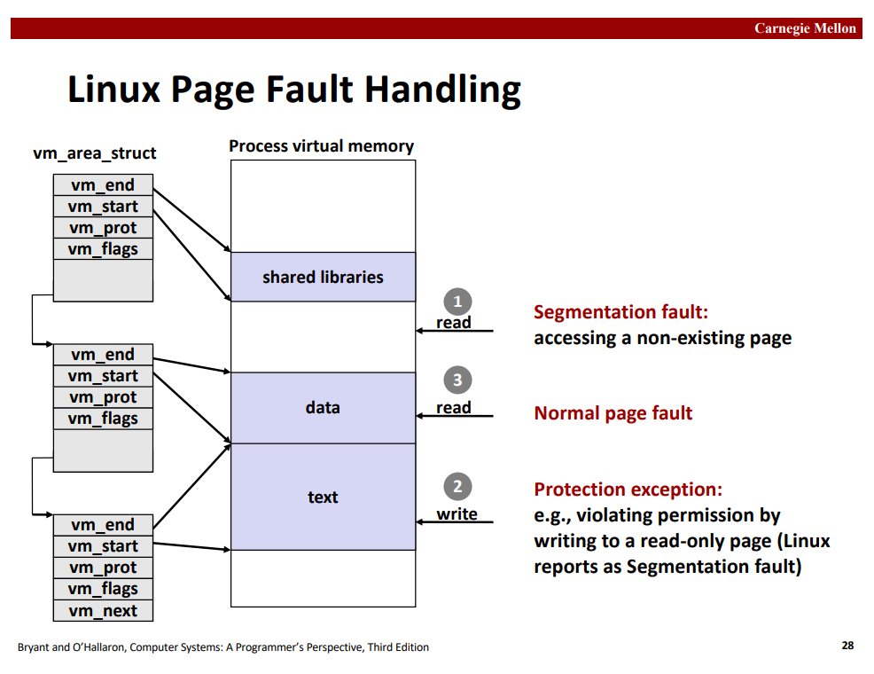
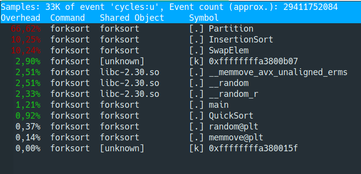

# Spis treści

- [Zadanie 1](#zadanie-1)
- [Zadanie 2](#zadanie-2)
- [Zadanie 3](#zadanie-3)
- [Zadanie 4](#zadanie-4)
- Zadanie 5 - brak
- Zadanie 6 - brak
- [Zadanie 7](#zadanie-7)
- Zadanie 8 - brak

***

# Zadanie 1 

### Na podstawie §49.1 wyjaśnij słuchaczom różnicę między <u>*odwzorowaniami plików w pamięć*</u> (ang. memory-mapped files) i <u>*odwzorowaniami pamięci anonimowej*</u> (ang. anonymous mappings).

- **odwzorowanie pliku w pamięć** – zmapowanie obszaru pliku bezpośrednio do pamięci wirtualnej procesu. Umożliwia to bezpośredni dostęp do zawartości plików i operowanie na jego bajtach. Strony są automatycznie ładowane z pliku w razie potrzeby.

- **odwzorowanie pamięci anomimowej** – mapowanie, które nie ma odpowiadajacego mu pliku. 

### Jaką zawartością wypełniana jest pamięć wirtualna należąca do tychże odwzorowań?

- pliki – zawartość pliku z dysku
- pamięć anonimowa – zainicjalizowana zerami

### Czym różni się odwzorowanie <u>*prywatne*</u> od <u>*dzielonego*</u>?

Pamięć odwzorowania dla jednego procesu może być dzielona z odwzorowaniami w innych procesach (tj. w tabeli stron wpisy obu procesów wskazują na te same strony w pamięci RAM). Może to stać się na dwa sposoby: dwa procesy odwzorowują ten sam obszar pliku, lub poprzez `fork()`.

- **odwzorowanie prywatne** (`MAP_PRIVATE`) – modyfikacje zawartości odwzorowania nie są widoczne dla innych procesów, a dla odwzorowań plików nie są zapisywane do pliku. Zmiany w prywatnych odwzorowaniach są prywatne dla każdego procesu. Jądro dokonuje tego poprzez użycie **kopiowania przy zapisie**. Oznacza to, że kiedy proces próbuje modyfikować zawartość strony, jądro tworzy nową, oddzielną kopię tej strony dla procesu.
- **odwzorowanie dzielone** – modyfikacje zawartości odwzorowania są widoczne dla innych procesów dzielących to samo odwzorowanie oraz zapisywane do pliku w przypadku odwzorowań pliku.

### Dlaczego odwzorowania prywatne wykorzystują technikę <u>*kopiowania przy zapisie*</u>?

Odwzorowania prywatne wykorzystują technikę **kopiowanie przy zapisie** po to, żeby zmiany w odwzorowanej pamięci nie były widoczne dla innych procesów. Dopóki procesy nie dokonują żadnych zapisów, to nie ma potrzeby kopiowania pamięci. Gdy któryś spróbuje coś zapisać, powinno to być widoczne jedynie dla niego (dostaje on więc własną kopię).

***

# Zadanie 2

### Na podstawie opisu do tabeli 49 –1 podaj scenariusze użycia prywatnych albo dzielonych odwzorowań plików w pamięć albo pamięci anonimowej.


Scenariusze użycia:

- odwzorowania prywatne:
    - odwzorowanie pliku – zainicjalizowanie regionu pamięci z zawartości pliku (np. inicjalizacja sekcji *text* lub *data* procesu z pliku wykonwywalnego).
    - odwzorowanie anonimowe – alokacja nowej (wypełnionej zerami) pamięci dla procesu (np. `malloc` używa `mmap`).
- odwzorowania dzielone:
    - odwzorowanie pliku:
        1. alternatywa dla używania `read` i `write` przy I/O do plików.
        2. szybka komunikacja międzyprocesowa dla niepowiązanych ze sobą procesów
    - odwzorowanie anonimowe – komunikacja międzyprocesowa pomiędzy powiązanymi procesami

### Pokaż jak je utworzyć z użyciem wywołania [mmap(2)](http://man7.org/linux/man-pages/man2/mmap.2.html).

```C
// sygnatura funkcji
void *mmap(void *addr, size_t length, int prot, int flags, int fd, off_t offset);
// odwzorowanie prywatne pliku
void* p_file = mmap(NULL, «rozmiar», «protekcja», MAP_FILE | MAP_PRIVATE, «deskryptor», «offset»);
// odwzorowanie prywatne pamięci anonimowej
void* p_anon = mmap(NULL, «rozmiar», «protekcja», MAP_ANONYMOUS | MAP_PRIVATE, -1, 0);
// odwzorowanie dzielone pliku
void* s_file = mmap(NULL, «rozmiar», «protekcja», MAP_FILE | MAP_SHARED, «deskryptor», «offset»);
// odwzorowanie dzielone pamięci anonimowej
void* s_anon = mmap(NULL, «rozmiar», «protekcja», MAP_ANONYMOUS | MAP_SHARED, -1, 0);
```

- «rozmiar» – długość odwzorowania (większa od 0)
- «protekcja» – `PROT_NONE` lub bitowa alternatywa wybranych flag z `PROT_EXEC`, `PROT_READ`, `PROT_WRITE`.
- «deskryptor» – deskryptor mapowanego pliku (-1 dla pamięci anonimowej)
- «offset» – przesunięcie względem mapowanego pliku (0 dla pamięci anonimowej)

### Rozważ co się z nimi dzieje po wywołaniu [fork(2)](http://man7.org/linux/man-pages/man2/fork.2.html).

Odwzorowania są dziedziczone po wywołaniu `fork()` (zarówno prywatne jak i dzielone). Zapisy do odwzorowanej pamięci prywatnej odbywają się na zasadzie *copy-on-write*.
`munmap` wykonany jakiś proces ma efekt jedynie w obrębie tego procesu (np. nie usuwa odwzorowań dla rodzica).

### Jakie odwzorowania tworzy wywołanie [execve(2)](http://man7.org/linux/man-pages/man2/execve.2.html)?

Wywołanie `execve()` nie zachowuje odwzorowań pamięci.

(**???** *zgaduję bo nic nie jest napisane nigdzie*) – execve tworzy odwzorowanie prywatne pliku wykonywalnego (np. sekcje `text` lub `data` uruchamianego programu) + odwzorowanie anonimowe np. dla stosu + odwzorowania dla bibliotek dzielonych. (**???**)

### Które z wymienionych odwzorowań mogą wymagać użycia <u>*pamięci wymiany*</u> (ang. swap space) i dlaczego?

**pamięć wymiany** – miejsce na dysku, w którym system przechowuje strony, które nie mieszczą się fizycznie w pamięci RAM.

Pamięć wymiany może być wymagana w przypadku używania prywatnych odwzorowań plików z prawami do pisania, gdyż zmiany w prywatnym odwzorowaniu nie są zapisywane do faktycznego pliku. W przypadku stron tylko do odczytu, nie ma potrzeby przechowywania ich w pamięci wymiany.
Mie ma również potrzeby przydzielania pamięci wymiany dla mapowań dzielonych plików, gdyż sam plik zachowuje się jak swoja pamięć wymiany.
Anonimowe mapowania z prawem do zapisu mogą wymagać użycia pamięci wymiany.

Za pomocą flagi `MAP_NORESERVE` można ustalić czy należy zarezerwować miejsce w pamięci wymiany dla tworzonego mapowania.

***

# Zadanie 3

### Na podstawie slajdów do wykładu wyjaśnij w jaki sposób system Linux obsługuje błąd strony.



*Page fault* następuje gdy proces
1) próbuje odczytać coś z nieistniejącej strony
2) próbuje dostać się do strony, która nie znajduje się jeszcze w pamięci
3) próbuje dostać się do strony bez odpowiednich uprawnień

Obsługa błędu (nie ze slajdów):
1. przekazanie kontroli do jądra. Zapisanie kontekstu.
2. jądro sprawdza jaka strona wywołała błąd
3. Jeżeli adres wirtualny jest poprawny, system wczytuje odpowiednią ramkę strony. Jeżeli trzeba ją zapisać to na czas tej akcji I/O kernel przekazuje kontrolę innemu procesowi.
4. Jeżeli adres nie jest poprawny (np. NULL) bądź strona nie ma odpowiednich uprawnień do wykonywanej akcji (np. zapis do strony *read-only*), to wówczas kernel wysyła procesowi sygnał `SIGSEGV`.

### Kiedy jądro wyśle procesowi sygnał `SIGSEGV` z kodem `SEGV_MAPERR` lub `SEGV_ACCERR`? 

- `SEGV_MAPPER` – strona nie była odwzorowana w przestrzeni adresowej procesu.
- `SEGV_ACCERR` – strona nie miała odpowiednich uprawnień.

### W jakiej sytuacji wystąpi <u>*pomniejszy*</u> (ang. minor) błąd strony lub <u>*poważny*</u> (ang. major) błąd strony?

- **major** – strona nie znajduje się w pamięci. Inaczej *hard page fault*. Występuje przez to, że system odracza ładowanie rzeczy do pamięci aż do pierwszego dostępu do danych.
- **minor** – strona jest załadowana do pamięci ale nie jest oznaczona jako załadowana prezz MMU dla danego procesu. Jądro musi jedynie oznaczyć tę stronę jako załadowaną. Może się to wydarzyć kiedy pamięć jest dzielona przez różne programy i strona została już załadowana, dla któregoś z nich lub gdy strona została usunięta ze zbioru roboczego procesu ale nie została zapisana na dysk ani usunięta.

### Jaką rolę pełni <u>*bufor stron*</u> (ang. page cache)?

- **bufor stron** (ang. *page cache*) – fragment pamięci RAM wykorzystywany do przyspieszenia odczytów i zapisów na dysku. Przy zapisie, zamiast od razu zapisywać wszystko na dysku, zmiany zostają dokonane jedynie w buforze stron a modyfikowane przechowywane tam strony oznaczone jako *dirty*. Zmiany zapisywane są na dysk regularnie lub przy użyciu `sync`/`fsync`. Poprawiona zostaje również szybkość odczytu, gdyż kolejne wczytania tej samej strony mogą odbyć się poprzez bufor stron o ile szukana strona dalej się tam znajduje.

### Kiedy wystąpi błąd strony przy zapisie mimo, że pole `vm_prot` pozwala na zapis do <u>*obiektu wspierającego*</u> (ang. backing object)?

-- **obiekt wspierający** – plik przy odwzorowaniu pliku „lub inny objekt” (??!).

(**Uwaga** – zgaduję) błąd strony może wystąpić gdy strona, do której piszemy, nie jest załadowana do pamięci?

### Kiedy jądro wyśle `SIGBUS` do procesu posiadającego odwzorowanie pliku w pamięć (§49.4.3)?

- `SIGBUS` – sygnał wysyłany procesowi, który próbuje uzyskać dostęp do pamięci, której CPU nie jest w stanie fizyzcnie zaadresować (na przykład adres niepodzielny przez 4).

***

# Zadanie 4

### Niech właścicielem programu A oraz B są odpowiednio użytkownik 0 `root` i 1000 `cahir`. Obydwa pliki mają ustawiony bit `set-uid`. Proces o uruchomiony na uprawnieniach użytkownika 2000 `student` używa wywołania [execve(2)](http://man7.org/linux/man-pages/man2/execve.2.html) do wykonania procesu A i B. 
### Podaj wartości <u>*rzeczywistego*</u>, <u>*obowiązującego*</u> i <u>*zachowanego*</u> identyfikatora użytkownika po wywołaniu `execve`.

- **rzeczywiste id** (ang. *real id*) – użytkownik, który jest właścicielem procesu. Decyduje o uprawnieniach do wysyłania sygnałów.
- **obowiązujące id** (ang. *effective id*) – zwykle to samo co rzeczywiste ale czasami jest zmieniane żeby umożliwić nieuprzywilejowanemu użytkownik dostęp do plików, do których dostęp ma tylko *root*. Używane do sprawdzania dostępu. Tworzone pliki należą do użytkownika o obowiązującym id. Programy z bitem *setuid* zmieniają obowiązujące id.
- **zachowane id** (ang. *saved id*) – zapisane poprzednie *id* w przypadku tymczasowych zmian obowiązującego id. Nieuprzywilejowany proces może ustawić swoje obowiązujące id na rzeczywiste id, obowiązujące id bądź zachowane id.

- Po wywołaniu programu **A**:
    - *rzeczywiste id*: 2000 (`student`)
    - *obowiązujące id*: 0 (`root`)
    - *zachowane id*: 0 (`root`)
- Po wywołaniu programu **B**:
    - *rzeczywiste id*: 2000 (`student`)
    - *obowiązujące id*: 1000 (`cahir`)
    - *zachowane id*:  1000 (`cahir`)

### Jakie instrukcje muszą wykonać programy A i B, aby prawidłowo przywrócić tożsamość użytkownika student? Należy użyć wywołań [seteuid(2)](http://man7.org/linux/man-pages/man2/seteuid.2.html) i [setreuid(2)](http://man7.org/linux/man-pages/man2/setreuid.2.html).

- program **A**:
```C
seteuid(0) // jeżeli obowiązujące id != 0 i zapisane id = 0
// obowiązujące id = root
setuid(2000)
// obowiązujące id = rzeczywiste id = zachowane id = student
```
- program **B**:
```C
// obowiązujące id = cahir
setreuid(2000, 2000)
// obowiązujące id = zapisane id = student
```

***

# Zadanie 7

- **zużycie procesora** (ang. *CPU time*) – czas jaki procesor spędził na wykonywaniu instrukcji procesu.

- **czas przebywania w systemie** (ang. *turnaround time*) – czas od utworzenia do ukończenia procesu.

Program:
- [forksort.c](./programy/forksort.c)

### Porównaj <u>*zużycie procesora*</u> (ang. CPU time) i <u>*czas przebywania w systemie*</u> (ang. turnaround time) przed i po wprowadzeniu delegacji zadań do podprocesów. 

Przed:
```
real    0m8,366s
user    0m8,083s
sys	    0m0,236s
```
Po:
```
real    0m3,177s
user    0m8,427s
sys	    0m0,603s
```

Uzyskane przyspieszenie: $\frac{8,366}{3,177} \approx 2.6333$

### Na podstawie prawa [Amdahla](https://pl.wikipedia.org/wiki/Prawo_Amdahla) wyjaśnij zaobserwowane różnice. 

**Uwaga** – wszystko co jest tutaj napisane jest z całkiem sporym prawdopodobieństwem fałszem.



Jak widać, około ~80% czasu spędzamy na zadaniach, które można było liczyć równolegle (pomijając np. liczenie jednocześnie `Partition` na fragmencie tablicy i jej podprzedziale).

$$ \frac{1}{(1 - P) + \frac{P}{N}} \approx S, $$
gdzie $S$ jest przyspieszeniem.

- $N = 4$ – liczba procesorów
- $P \approx 0.8$ – procent programu, który można zrównoleglić

$$\frac{1}{(1 - 0.8) + \frac{0.8}{4}} = \frac{1}{0.2 + 0.2} = \frac{1}{0.4} \approx 2.5$$
więc mniej więcej się zgadza.

### Których elementów naszego algorytmu nie da się wykonywać równolegle?

Równolegle nie da się:
- `InsertSort`
- `Partition`
