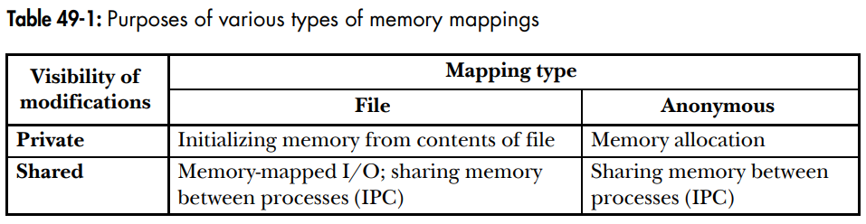

# Spis treści

- [Zadanie 1](#zadanie-1)
- [Zadanie 2](#zadanie-2)

***

# Zadanie 1 

### Na podstawie §49.1 wyjaśnij słuchaczom różnicę między *odwzorowaniami plików w pamięć* (ang. memory-mapped files) i *odwzorowaniami pamięci anonimowej* (ang. anonymous mappings).

- **odwzorowanie pliku w pamięć** – zmapowanie obszaru pliku bezpośrednio do pamięci wirtualnej procesu. Umożliwia to bezpośredni dostęp do zawartości plików i operowanie na jego bajtach. Strony są automatycznie ładowane z pliku w razie potrzeby.

- **odwzorowanie pamięci anomimowej** – mapowanie, które nie ma odpowiadajacego mu pliku. 

### Jaką zawartością wypełniana jest pamięć wirtualną należącą do tychże odwzorowań?

- pliki – zawartość pliku z dysku
- pamięć anonimowa – zainicjalizowana zerami

### Czym różni się odwzorowanie *prywatne* od *dzielonego*?

Pamięć odwzorowania dla jednego procesu może być dzielona z odwzorowaniami w innych procesach (tj. w tabeli stron wpisy obu procesów wskazują na te same strony w pamięci RAM). Może to stać się na dwa sposoby: dwa procesy odwzorowują ten sam obszar pliku, lub poprzez `fork()`.

- **odwzorowanie prywatne** (`MAP_PRIVATE`) – modyfikacje zawartości odwzorowania nie są widoczne dla innych procesów, a dla odwzorowań plików nie są zapisywane do pliku. Zmiany w prywatnych odwzorowaniach są prywatne dla każdego procesu. Jądro dokonuje tego poprzez użycie **kopiowania przy zapisie**. Oznacza to, że kiedy proces próbuje modyfikować zawartość strony, jądro tworzy nową, oddzielną kopię tej strony dla procesu.
- **odwzorowanie dzielone** – modyfikacje zawartości odwzorowania są widoczne dla innych procesów dzielących to samo odwzorowanie oraz zapisywane do pliku w przypadku odwzorowań pliku.

### Dlaczego odwzorowania prywatne wykorzystują technikę *kopiowania przy zapisie*?

Odwzorowania prywatne wykorzystują technikę **kopiowanie przy zapisie** po to, żeby zmiany w odwzorowanej pamięci nie były widoczne dla innych procesów. Dopóki procesy nie dokonują żadnych zapisów, to nie ma potrzeby kopiowania pamięci. Gdy któryś spróbuje coś zapisać, powinno to być widoczne jedynie dla niego (dostaje on więc własną kopię).

***

# Zadanie 2

### Na podstawie opisu do tabeli 49 –1 podaj scenariusze użycia prywatnych albo dzielonych odwzorowań plików w pamięć albo pamięci anonimowej.



Scenariusze użycia:

- odwzorowania prywatne:
    - odwzorowanie pliku – zainicjalizowanie regionu pamięci z zawartości pliku (np. inicjalizacja sekcji *text* lub *data* procesu z pliku wykonwywalnego).
    - odwzorowanie anonimowe – alokacja nowej (wypełnionej zerami) pamięci dla procesu (np. `malloc` używa `mmap`).
- odwzorowania dzielone:
    - odwzorowanie pliku:
        1. alternatywa dla używania `read` i `write` przy I/O do plików.
        2. szybka komunikacja międzyprocesowa dla niepowiązanych ze sobą procesów
    - odwzorowanie anonimowe – komunikacja międzyprocesowa pomiędzy powiązanymi procesami

### Pokaż jak je utworzyć z użyciem wywołania [mmap(2)](http://man7.org/linux/man-pages/man2/mmap.2.html).

```C
// sygnatura funkcji
void *mmap(void *addr, size_t length, int prot, int flags, int fd, off_t offset);
// odwzorowanie prywatne pliku
void* p_file = mmap(NULL, «rozmiar», «protekcja», MAP_FILE | MAP_PRIVATE, «deskryptor», «offset»);
// odwzorowanie prywatne pamięci anonimowej
void* p_anon = mmap(NULL, «rozmiar», «protekcja», MAP_ANONYMOUS | MAP_PRIVATE, -1, 0);
// odwzorowanie dzielone pliku
void* s_file = mmap(NULL, «rozmiar», «protekcja», MAP_FILE | MAP_SHARED, «deskryptor», «offset»);
// odwzorowanie dzielone pamięci anonimowej
void s_anon = mmap(NULL, «rozmiar», «protekcja», MAP_ANONYMOUS | MAP_SHARED, -1, 0);
```

- «rozmiar» – długość odwzorowania (większa od 0)
- «protekcja» – `PROT_NONE` lub bitowa alternatywa wybranych flag z `PROT_EXEC`, `PROT_READ`, `PROT_WRITE`.
- «deskryptor» – deskryptor mapowanego pliku (-1 dla pamięci anonimowej)
- «offset» – przesunięcie względem mapowanego pliku (0 dla pamięci anonimowej)

### Rozważ co się z nimi dzieje po wywołaniu [fork(2)](http://man7.org/linux/man-pages/man2/fork.2.html).

Odwzorowania są dziedziczone po wywołaniu `fork()` (zarówno prywatne jak i dzielone). Zapisy do odwzorowanej pamięci prywatnej odbywają się na zasadzie *copy-on-write*.
`munmap` wykonany jakiś proces ma efekt jedynie w obrębie tego procesu (np. nie usuwa odwzorowań dla rodzica).

### Jakie odwzorowania tworzy wywołanie [execve(2)](http://man7.org/linux/man-pages/man2/execve.2.html)?

Wywołanie `execve()` nie zachowuje odwzorowań pamięci.

(**???** *zgaduję bo nic nie jest napisane nigdzie*) – execve tworzy odwzorowanie prywatne pliku wykonywalnego (np. sekcje `text` lub `data` uruchamianego programu) + odwzorowanie anonimowe np. dla stosu. (**???**)

### Które z wymienionych odwzorowań mogą wymagać użycia *pamięci wymiany* (ang. swap space) i dlaczego?

**pamięć wymiany** – miejsce na dysku, w którym system przechowuje strony, które nie mieszczą się fizycznie w pamięci RAM.

Pamięć wymiany może być wymagana w przypadku używania prywatnych odwzorowań plików z prawami do pisania, gdyż zmiany w prywatnym odwzorowaniu nie są zapisywane do faktycznego pliku. W przypadku stron tylko do odczytu, nie ma potrzeby przechowywania ich w pamięci wymiany.
Mie ma również potrzeby przydzielania pamięci wymiany dla mapowań dzielonych plików, gdyż sam plik zachowuje się jak swoja pamięć wymiany.
Anonimowe mapowania z prawem do zapisu mogą wymagać użycia pamięci wymiany.

Za pomocą flagi `MAP_NORESERVE` można ustalić czy należy zarezerwować miejsce w pamięci wymiany dla tworzonego mapowania.

***

