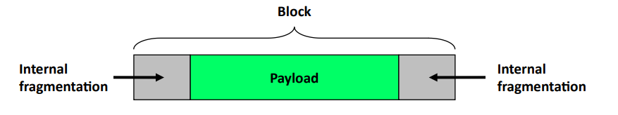
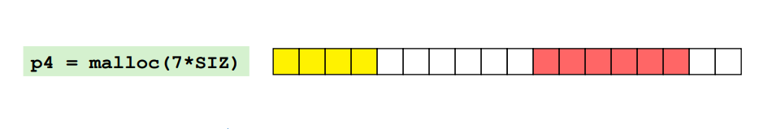
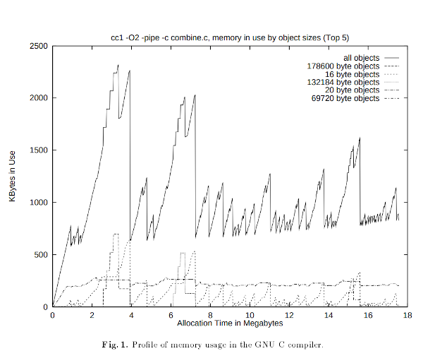
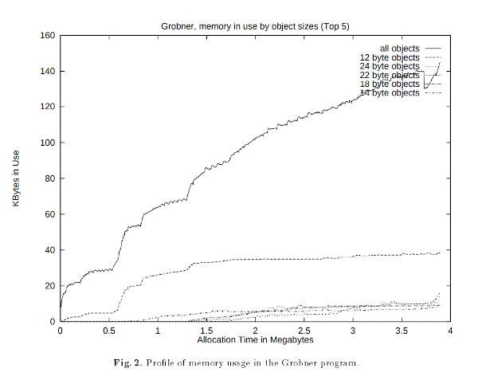
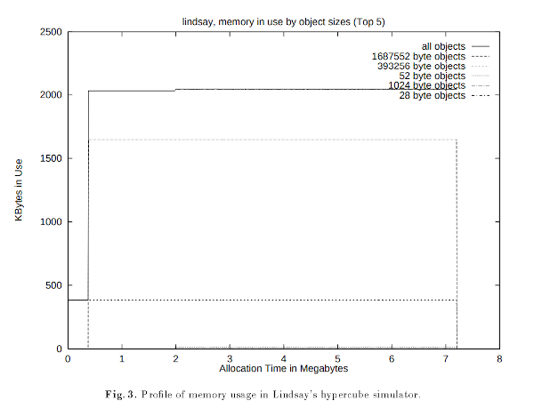

# Spis treści

- [Zadanie 1](#zadanie-1)
- [Zadanie 2](#zadanie-2)
- [Zadanie 3](#zadanie-3)
- Zadanie 4 - brak
- Zadanie 5 - brak
- Zadanie 6 - brak
- Zadanie 7 - brak
- Zadanie 8 - brak

***

# Zadanie 1

### Systemy uniksowe udostępniają wywołania systemowe [sbrk(2)](http://man7.org/linux/man-pages/man2/sbrk.2.html) oraz parę [mmap(2)](http://man7.org/linux/man-pages/man2/mmap.2.html) i [munmap(2)](http://man7.org/linux/man-pages/man2/munmap.2.html). Służą one do przydziału stron na użytek bibliotecznego algorytmu zarządzania pamięcią. Czemu implementacje [malloc(3)](http://man7.org/linux/man-pages/man3/malloc.3.html) preferują drugą opcję? Wyjaśnij to odwołując się do mapy pamięci wirtualnej procesu.

`malloc` preferuje użycie `mmap`+`munmap`, gdyż kiedy zaalokowany wcześniej obszar pamięci przestaje być potrzebny, to wówczas można zwolnić go przy użyciu wywołania `munmap`. W przypadku, gdy używane jest wywołanie `sbrk`, to można jedynie przesunąć koniec sterty, więc nie da się całkowicie zwolnić pamięci znajdującej się na początku sterty jeżeli dalej jest jakaś zaalokowana pamięć (`sbrk` w pewnym sensie działa jak push/pop na stosie).

W przypadku takim jak na rysunku, jeżeli `malloc` używa `sbrk`, to wówczas wcześniej zaalokowana, nieużywana pamięć (zaznaczona na czerwono) nie może zostać oddana systemowi operacyjnego dopóki nie zwolni się później zaalokowany obszar zaznaczone na zielono.

***

# Zadanie 2

### Wyjaśnij różnicę między <u>*fragmentacją wewnętrzną*</u> i <u>*zewnętrzną*</u>.

- **fragmentacja wewnętrzna** – następuje w przypadku, gdy rozmiar alokowanej pamięci jest mniejszy niż rozmiar jednego bloku. Wówczas nadmiarowa pamięć marnuje się.

- **fragmentacja zewnętrzna** – występuje gdy łączna suma wolnej pamięci jest wystarczająco duża do obsłużenia żądania alokacji, ale żaden z wolnych bloków nie jest wystarczająco duży i nie jest możliwa ich konsolidacja.

### Czemu nie można zastosować <u>*kompaktowania*</u> w bibliotecznym algorytmie przydziału pamięci?

**kompaktowanie** – defragmentacja zaalokowanej pamięci poprzez przeniesienie bloków tak, aby leżały obok siebie, co eliminuje fragmentację zewnętrzną.

Nie można zastosować **kompaktowania** w bibliotecznym algorytmie przydziału pamieci, gdyż **kompaktowanie** unieważnia stare wskaźniki (wskaźnik przestaje być poprawny, gdyż odpowiadająca mu pamięć została przeniesiona pod inny adres i nie ma możliwości automatycznego zaktualizowania tych wskaźników).

### Na podstawie §2.3 opowiedz o dwóch głównych przyczynach występowania fragmentacji zewnętrznej.

- *Fragmentation is caused by isolated deaths*: krytycznym problemem jest tworzenie wolnych obszarów, których sąsiadujące obszary nie są wolne. Składają się na to dwie rzeczy: które obiekty zostają umieszczone w przyległych obszarach, i kiedy te obiekty umierają. Jeżeli obiekty zostają zwolnione w rożnych momentach, to powstają pomiędzy nimi przerwy.

- *Fragmentation is caused by time-varying behavior*: fragmentacja powstaje przez to, że z upływem czasu może zmieniać się zachowanie programu w sensie tego, jakich alokacji dokonuje – np. zwalnianie małych bloków i alokowanie bardzo dużych, bądź alokowanie wielu obiektów różnych typów. Alokator powinien umieć zauważyć wzorce w alokacji w celu minimalizacji fragmentacji.

***

# Zadanie 3

### Posługując się wykresem wykorzystania pamięci w trakcie życia procesu opowiedz o trzech wzorcach przydziału pamięci występujących w programach (§2.4).

- kompilator *GNU C* kompilujący plik `combine.c` ze swojego kodu źródłowego:
    - program jest podzielany na etapy, z kilkoma podobnymi większymi wzrostami użycia pamięci.
    - każdej z trzech alokacji dużych obiektów (178600 bajtów) towarzyszy następująca po ich zwolneniu alokacja bardzo wielu małych obiektów (16 bajtów).
    - niemal takie same użycie pamięci przez cały czas działania programu dla obiektów pewnego rozmiaru (<u>20</u> lub 69720 bajtów ale ciężko stwierdzić bo jakiś geniusz dał prawie takie same liniie dla obu).
    - całkiem odmienny profil użytkowania obiektów różnych rozmiarów

- *program Grobnera* liczący *bazę Gröbnera*:
    - zużycie pamięci wzrasta stopniowo z czasem działania programu z pomniejszymi odchyleniami (małe płaskowyże)
    - proporcje obiektów różnych rozmiarów są podobne z wyjątkiem tych najmniejszych (12 bajtów), których jest znacznie więcej.

- *symulator hiperkostki Lindsay'a*:
    - duży i prosty płaskowyż
    - program alokuje pojedynczy wielki obiekt na początku wykonania, który żyje przez niemal cały czas działania programu
    - w trakcie działania programu alokowana jest bardzo mała liczba małych obiektów, które żyją bardzo krótko

### Na podstawie paragrafu zatytułowanego „*Exploiting ordering and size dependencies*” wyjaśnij jaki jest związek między czasem życia bloku, a jego rozmiarem?

- Rozmiar obiektu zwykle jest powiązany z jego typem i zastosowaniem. Obiekty tego samego typu, zaalokowane razem, z wysokim prawdopodoobieństwem zostaną zwolnione w tym samym momencie, więc warto jest umieszczać je obok siebie w ciągłych obszarach pamięci aby minimalizować występowanie sytuacji, gdy obiekty o długiej żywotności są rozproszone pośród tych o krótkim czasie życia.

### Wyjaśnij różnice między politykami znajdowania wolnych bloków: <u>*first-fit*</u>, <u>*next-fit*</u> i <u>*best-fit*</u>. Na podstawie §3.4 wymień ich słabe i mocne strony.

- **first-fit** – wybierany jest pierwszy wolny blok z listy o dostatecznie dużym romiarze. Jeżeli blok jest za duży, to zostaje podzielony. Wyszukiwanie rozpoczyna się od początku listy wolnych bloków.
    - słabe strony:
        - prowadzi do fragmentacji pamięci przez rozdzielanie dużych bloków na początku listy
        - duża liczba małych bloków (*splinters*) na początku listy powstałych przez rozdzielanie prowadzi do wydłużonego czasu wyszukiwania
    - mocne strony:
        - proste
        - użycie *Address-ordered first-fit* (umieszczanie bloków na liście w kolejności ich adresów) pozwala na szybką konsolidację bloków ze względu na to, że sąsiadujące ze sobą bloki są obok siebie na liście
- **next-fit** – wyszukiwanie bloków dla kolejnych alokacji jest kontynuowane od miejsca gdzie nastąpiła poprzednia alokacja.
    - słabe strony:
        - obiekty z tych samych faz programu są rozrzucone w różnych miejscach w pamięci co zwiększa fragmentację w przypadku, gdy obiekty w różnych fazach mają różne czasy życia
        - niekorzystne dla lokalności przestrzennej
    - mocne strony:
        - zwykle szybsze niż **first-fit** bo unika przeglądania bloków, które nie są przydatne
        - mniejsza akumulacja małych bloków na początku listy
- **best-fit** – wyszukiwany jest najmniejszy możliwy blok, który jest dostatecznie duży.
    - słabe strony:
        - alokowanie zwykle działa wolniej niż **first-fit** i **next-fit** bo wymaga przejrzenia większej liczby bloków
        - nie skaluje się dobrze dla dużych stert z wieloma wolnymi blokami
    - mocne strony:
        - minimalizuje marnowanie pamięci

***

