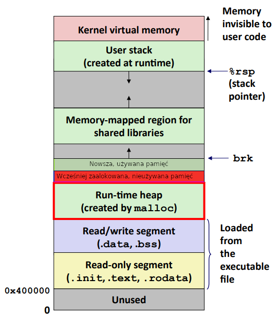

# Spis treści

- [Zadanie 1](#zadanie-1)
- Zadanie 2 - brak
- Zadanie 3 - brak
- Zadanie 4 - brak
- Zadanie 5 - brak
- Zadanie 6 - brak
- Zadanie 7 - brak
- Zadanie 8 - brak

***

# Zadanie 1

### Systemy uniksowe udostępniają wywołania systemowe [sbrk(2)](http://man7.org/linux/man-pages/man2/sbrk.2.html) oraz parę [mmap(2)](http://man7.org/linux/man-pages/man2/mmap.2.html) i [munmap(2)](http://man7.org/linux/man-pages/man2/munmap.2.html). Służą one do przydziału stron na użytek bibliotecznego algorytmu zarządzania pamięcią. Czemu implementacje [malloc(3)](http://man7.org/linux/man-pages/man3/malloc.3.html) preferują drugą opcję? Wyjaśnij to odwołując się do mapy pamięci wirtualnej procesu.

`malloc` preferuje użycie `mmap`+`munmap`, gdyż kiedy zaalokowany wcześniej obszar pamięci przestaje być potrzebny, to wówczas można zwolnić go przy użyciu wywołania `munmap`. W przypadku, gdy używane jest wywołanie `sbrk`, to można jedynie przesunąć koniec sterty, więc nie da się całkowicie zwolnić pamięci znajdującej się na początku sterty jeżeli dalej jest jakaś zaalokowana pamięć (`sbrk` w pewnym sensie działa jak push/pop na stosie).

W przypadku takim jak na rysunku, jeżeli `malloc` używa `sbrk`, to wówczas wcześniej zaalokowana, nieużywana pamięć (zaznaczona na czerwono) nie może zostać oddana systemowi operacyjnego dopóki nie zwolni się później zaalokowany obszar zaznaczone na zielono.

***

