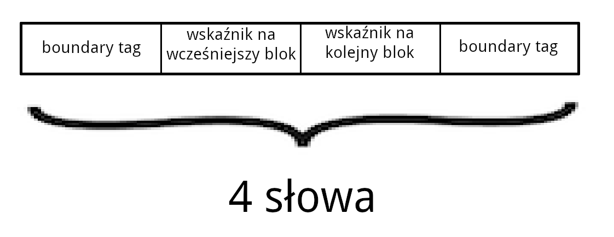
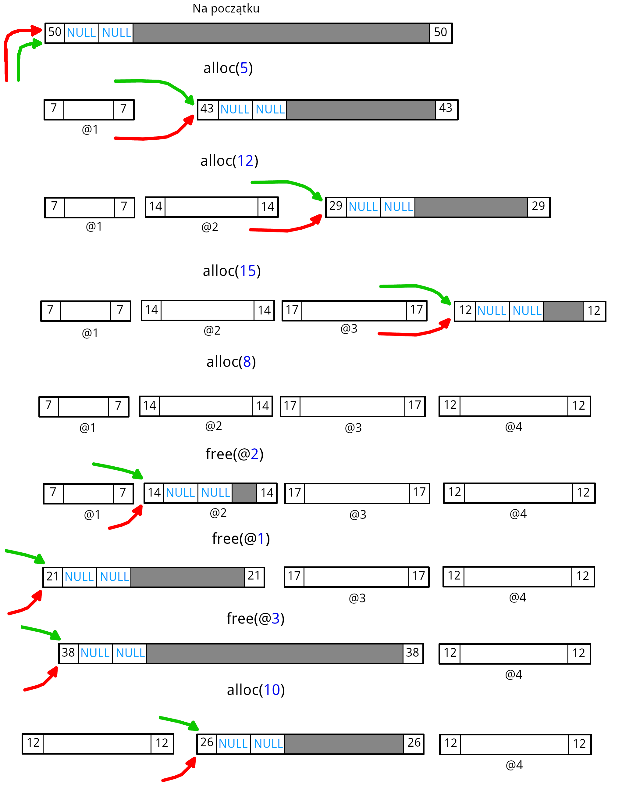
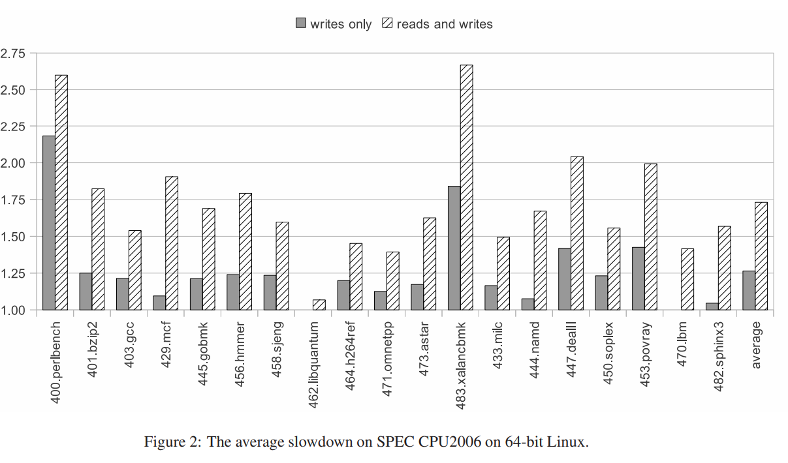
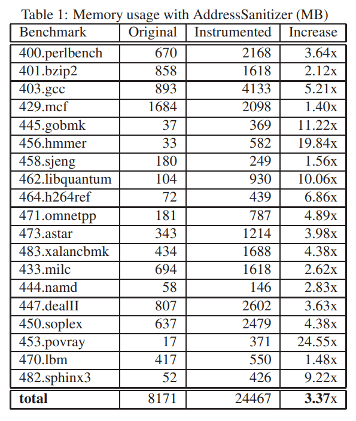
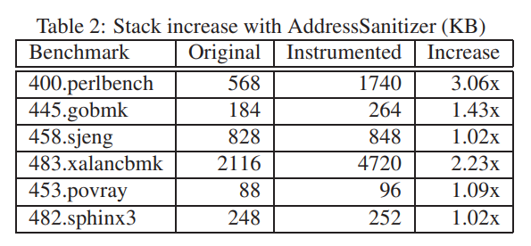

# Spis treści

*Dla spotęgowania intensywności doznań wizualnych wynikających z czytania tych rozwiązań polecam oglądanie ich gdzieś indziej niż bezpośrednio na githubie, bo nie renderuje on tam ani html-a, ani LaTeXa*

- [Zadanie 1](#zadanie-1)
- [Zadanie 2 (bonus)](#zadanie-2-bonus)
- [Zadanie 3](#zadanie-3)
- [Zadanie 4](#zadanie-4)
- [Zadanie 5 (bonus)](#zadanie-5-bonus)

***

# Zadanie 1

### Algorytm przydziału pamięci udostępnia funkcje o sygnaturach $alloc: words \rightarrow @id$ i $free: @id \rightarrow void$ i ma do dyspozycji obszar 50 słów maszynowych. Implementacja używa dwukierunkowej listy wolnych bloków oraz boundary tags. Wyszukiwanie wolnych bloków działa zgodnie z polityką <u>*best-fit*</u>. Operacja zwalniania <u>*gorliwie złącza*</u> bloki i wstawia wolne bloki na początek listy.

- **best-fit** – podczas alokacji wyszukiwany jest pasujący blok o jak najmniejszym rozmiarze aby zminimalizować fragmentację.
- **gorliwe złączanie** – złączanie wolnych bloków od razu kiedy jest to możliwe a nie jedynie w razie potrzeby.

### Posługując się diagramem z wykładu wykonaj krokową symulację algorytmu przydziału pamięci dla poniższego ciągu żądań. Należy wziąć pod uwagę miejsce zajmowane przez struktury danych algorytmu przydziału oraz nieużytki.

Ciąg żądań:
```C
alloc(5) 
alloc(12) 
alloc(15) 
alloc(8) 
free(@2) 
free(@1) 
free(@3) 
alloc(10)
```

Zważywszy na to, że każdy blok ma posiadać boundary tags (header i footer) (oraz wskaźniki na poprzedni i kolejny wolny blok w przypadku wolnych bloków), to w takim razie najmniejszy możliwy rozmiar bloku jakiego możemy używać musi mieć rozmiar co najmniej 4 słów (jak na poniższym obrazku).



Symulacja przebiegu przydziałów pamięci (<span style="color: red">czerwona strzałka</span> – ostatni element listy, <span style="color: green">zielona strzałka</span> – pierwszy element listy. Strzałki wychodzą z zewnątrz):



*(wygląda podejrzanie bo nie powstało spaghetti ze strzałek ale może jest dobrze)*

***

# Zadanie 2 (bonus)

### Rozważmy algorytm przydziału pamięci z zadania pierwszego. Załóżmy, że implementujemy go na architekturze 64-bitowej – zatem słowo maszynowe ma 8 bajtów. Zarządzane areny będą nie większe niż 512KiB. Wskaźnik zwracany przez operację `malloc` będzie podzielny przez 16. 

### Zaproponuj metodę efektywnego kodowania metadanych, aby zminimalizować narzut pamięciowy...

Mamy areny o rozmiarze maksymalnie 512 KiB. Nasz `malloc` zwraca zawsze wskaźniki podzielne przez 16, więc tak naprawdę wystarczy żebyśmy potrafili zaadresować 32768 różnych miejsc w pamięci (512 KiB / 16). 32768 daje się zapisać na 16 bitach. Znamy adres początku areny. Dzięki temu wskaźniki na następny i poprzedni element listy potrzebują łącznie jedynie 32 bity.
Analogicznie, boundary tagi również potrzebują po 16 bitów na header i footer.
Możemy zaoszczędzić pamięć przechowując footer poprzedniego bloku w pierwszym słowie kolejnego. Dzięki temu wszystkie metadane mieszczą się w jednym słowie 64-bitowym.

Layout bloku:
```
[  16  ] [  16  ] [  16  ] [  16  ]
 footer   header    prev     next
```

`pointer(index) = &arena + index * 16`

*Edit*: alternatywnie:
```
[  16  ] [  16  ] [  16  ] [  16  ]
 footer   header  kanarek1 kanarek2
```
gdzie kanarek1 to np. footer z poprzedniego bloku a kanarek2 to header z poprzedniego bloku.


### ...oraz strategię wykrywania uszkodzenia danych algorytmu (tj. lista dwukierunkowa, *boundary tags*).

1) sprawdzanie, czy wskaźniki `prev` i `next` leżą w aktualnej arenie
2) sprawdzanie, czy `footer` aktualnego bloku przechowywany w następnym bloku jest taki jak `header`.

***

# Zadanie 3

### Rozważmy <u>*algorytm kubełkowy*</u> (§3.6) (ang. *segregated-fit*) przydziału pamięci z <u>*gorliwym złączaniem*</u> wolnych bloków.

- **algorytm kubełkowy** – przechowujemy tablicę list wolnych bloków w taki sposób, że każda z list przechowuje wolne bloki o konkretnym rozmiarze. Kiedy blok zostaje zwolniony, to zostaje dołączony do listy bloków tego rozmiaru. Kiedy żądana jest alokacja, to wybiera się blok z odpowiedniej, jak najmniejszej listy.

- **gorliwe złączanie** – [było](#zadanie-1)

### Jak przebiegają operacje `malloc` i `free`?

*(zakładamy, że mamy kubełki dla rozmiarów będących kolejnymi potęgami 2)*

- `malloc(n)`:
    1) wybierz taki kubełek, że przechowywana w nim lista przechowuje bloki o najmniejszym rozmiarze większym lub równym `n`
    2) jeżeli kubełek zawiera wolny blok, to usuń go z listy wolnych bloków, oznacz jako zajęty i zwróć wskaźnik na niego
    3) jeżeli kubełek był pusty, to szukaj bloku w kolejnym kubełku.
        4) jeżeli wszystkie kubełki były puste to zaalokuj nową stronę i wypełnij ją wolnymi blokami o szukanym rozmiarze
        5) jeżeli znaleziono wolny blok to podziel go. Blok z pozostałym miejscem umieść na odpowiedniej liście wolnych bloków. Oznacz zaalokowany blok jako zajęty.
- `free(ptr)`:
    1) oznacz blok jako wolny
    2) jeżeli sąsiadujący blok jest wolny to połącz go ze zwalnianym blokiem (powtarzać do skutku) i przenieś do odpowiedniej listy wolnych bloków.

###  Co robi `malloc`, gdy na danej liście nie ma wolnego bloku żądanego rozmiaru?

Szuka bloku o większym rozmiarze (który następnie podzieli). Jeżeli w ogóle nie ma dostatecznie dużych wolnych blokow to następuje alokacja nowej strony, którą wypełnia się (na przykład) blokami szukanego rozmiaru.

### Jak poradzić sobie w trakcie złączania wolnych bloków w procedurze `free`, jeśli chcemy usunąć ostatni element z listy? 

Jeżeli zwalniamy blok, który jest ostatni w swoim kubełku, to wówczas nie dzieje się nic specjalnego. Lista staje się pusta i tyle. *(nie rozumiem gdzie miałby być problem xd)*.

*EDIT:* jeżeli przyjmiemy, że ostatni element listy zawiera wskaźnik na początek listy większego kubełka, to trzeba jakoś przepiąć wskaźniki. Do końca listy z poprzedniego kubełka i początku następnego możemy dostać się w $O(1)$ więc to nie jest problem.

### Rozważ zastosowanie <u>*leniwego złączania*</u> wolnych bloków w algorytmie kubełkowym przydziału pamięci – jakie problemy zauważasz?

- **złączanie leniwe** – konsolidacja bloków następuje dopiero w momencie kolejnej alokacji (i nie napotkaliśmy jeszcze bloku o odpowiednio dużym rozmiarze).

Leniwe złączanie zmniejsza czas wyszukiwania bloków gdy chcemy dokonywać małych alokacji: przy złączaniu gorliwym małe bloki zostają skonsolidowane i w większości przypadków trzeba szukać miejsca wśrod tych większych. Leniwe złączanie pozwala również przenieść ciężar pracy ze zwalniania na alokowanie nowych obiektów.

Problemy: komplikuje algorytm alokacji? *(ja nie zauważam żadnych)*.

***

# Zadanie 4

### Programy `bad-*.c` posiadają kilka ukrytych błędów związanych z używaniem bloków pamięci przydzielonych dynamicznie. Zauważ, że kompilator nie zgłosił żadnych błędów ani ostrzeżeń, a uruchomienie tych programów nie kończy się błędem. 

### Wytypuj błędy i zapisz je w swoich notatkach. 

*(najgorszym błędem to jest nieludzkie zapisywanie gwiazdki przy nazwie zmiennej zamiast przy typie)*

- [bad-1.c](./programy/bad-1.c):
    - zły rozmiar: `int*` ma rozmiar 64 bitów a int 32 (oczywiście zależnie od architektury).
- [bad-2.c](./programy/bad-2.c)
    - `strlen` zwróci długość napisu `argv[1]` nie licząc znaku `'\0'`. Przy wywołaniu `strcpy` nastąpi próba zapisu `'\0'` z `s` pod błędny adres w `p`.
- [bad-3.c](./programy/bad-3.c)
    - w drugim `memset` jest `N` zamiast `M`. (`N` > `M` więc wykraczamy poza zaalokowaną pamięć).
    - dwa razy zwalniamy `x`
- [bad-4.c](./programy/bad-4.c)
    - w pętli próbujemy dokonywać dereferencji/dostępu do elementów zwolnionego wskaźnika/tablicy `x`.
- [bad-5.c](./programy/bad-5.c)
    - `new_node(i)` wykonuje się dwa razy bo jest wklejane przez makro w dwóch miejscach
    - zwalniany jest tylko pierwszy element listy zamiast całej listy
    - w `SLIS_INSERT_HEAD` jest `(elm)->field.sle_next = (head)->slh_first` a `head` nie jest przecież zainicjowane żadną sensowną wartością (w tym przypadku nie ma `NULL`a na końcu).
    - *(bonus (niezwiązane z pamięcią): sufiks `_t` jest zarezerwowany dla typów z POSIX)*
    - *(bonus2 (offtop): używanie tych paskudnych makr)*

Dodatkowo we wszystkich nie jest sprawdzane, czy `malloc` nie zakończył się błędem.

### Następnie skompiluj programy z instrumentacją kodu dodaną przez [address sanitizer](https://en.wikipedia.org/wiki/AddressSanitizer) – wystarczy odkomentować odpowiednią linię w pliku `Makefile` i ponownie zbudować pliki wykonywalne. Po uruchomieniu programów otrzymasz komunikaty błędów – wyjaśnij je. 

- bad-1: <span style="color:red">AddressSanitizer: heap-buffer-overflow</span>
    - miejsce na wskaźniki jest ucięte o połowę więc od pewnego momentu `p[i]` powoduje overflow
- bad-2: <span style="color:red">AddressSanitizer: heap-buffer-overflow</span>
    - wykraczamy poza tablicę o jeden bajt, więc jest overflow
- bad-3: <span style="color:red">AddressSanitizer: heap-buffer-overflow</span>
    - analogicznie jak w 2 ale o trochę więcej
- bad-4: <span style="color:red">AddressSanitizer: heap-use-after-free</span>
    - `use-after-free` czyli dereferencja zwolnionej pamięci (`x`)
- bad-5: <span style="color:red">LeakSanitizer: detected memory leaks</span>
    - memory-leak: zwalniana jest jedynie głowa listy

### Porównaj znalezione błędy z zanotowanymi kandydatami, a następnie popraw kod źródłowy.

Znalezione błędy są takie jak zanotowani kandydaci.

Poprawki:
- [good-1.c](./programy/good-1.c)
- [good-2.c](./programy/good-2.c)
- [good-3.c](./programy/good-3.c)
- [good-4.c](./programy/good-4.c)
- [good-5.c](./programy/good-5.c)

***

# Zadanie 5 (bonus)

### Zapoznaj się z artykułem [AddressSanitizer: A Fast Address Sanity Checker](https://www.usenix.org/system/files/conference/atc12/atc12-final39.pdf).

### Jaki jest koszt używania tego narzędzia (§4)?

Średnie spowolnienie według `perlbench` i `xalancbmk` to kolejno 2.60x i 2.67x. Oba benchmarki intensywnie korzystały z `malloc`-a i robiły ogromną liczbę jedno- i dwubajtowych dostępów do pamięci (programy przetwarzające tekst).

W przypadku instrumentacji wyłącznie zapisów, średnia spowolnienie to 26%. Użycie tego trybu umożliwa wykrywanie bugów związanych z pamięcią w programach wymagających wysokiej wydajności.

Użycie *AddressSanitizer*a powoduje również wzrost zużycia pamięci oraz stosu.

Zmniejszenie `Offset`-u powoduje wzrost wydajności tak jak zwiększenie `Scale`.





### Przedstaw zasadę działania tego narzędzia – w szczególności opowiedz o instrumentacji kodu (§3.1) i shadow map (§3.2).

*AddressSanitizer* przeznacza $1/8$ wirtualnej przestrzeni adresowej na tzw. *shadow memory*. Mapowanie wskaźnika `Addr` na *shadow memory* odbywa się za pomocą wzoru `(Addr >> Scale) + Offset`, gdzie `Scale` leży w przedziale 1...7 (domyślnie `Scale = 3`). `Scale=N` oznacza, że *shadow memory* zajmuje $1/2^N$ wirtualnej przestrzeni adresowej a minimalny rozmiar *redzone* wynosi $2^N$ bajtów. Każdy *shadow byte* opisuje stan $2^N$ bajtów z prawdziwej pamięci. Wskaźniki zwracane przez `malloc` zwykle są wyrównane do przynajmniej 8 bajtów. Oznacza to, że każda 8-bajtowa sekwencja pamięci na stercie jest w jednym z 9 stanów: pierwsze k $(0 \leq k \leq 8)$ bajtów jest adresowalnych a pozostałe $(8 - k)$ nie. Stany te można zakodowywać w pojedynczych bajtach *shadow memory*. `Offset` musi zostać tak wybrany, żeby obszar dla *shadow memory* nie był zajmowany przy uruchomieniu programu. `Offset` jest statycznie wybrany dla każdej platformy.


Jak widać na powyższym rysunku, pamięć jest podzielona na dwie części (górną i dolną). Górna mapuje się do górnej części *shadow memory* a dolna do dolnej. *Shadow memory* mapuje się do obszaru *bad*, który jest oznaczony jako niedostępny.

Bajt 0 oznacza, że wszystkie 8 bajtów w danym obszarze jest adresowalnych. $k$ $(1 \leq k \leq 7)$ oznacza, że pierwsze $k$ jest adresowalne. Wartość ujemna oznacza, że całe 8-bajtowe słowo jest nieadresowalne (różne wartości oznaczjaą różne rodzaje pamięci: *heap redzones*, *stack redzones*, *global redzones*, zwolnona pamięć).

Podczas instrumentacji dostępu do pamięci, *AddressSanitizer* oblicza adres odpowiadającego *shadow byte*, ładuje ten bajt i sprawdza, czy jest zerem. 
```c
ShadowAddr = (Addr >> 3) + Offset;
if (*ShadowAddr != 0)
ReportAndCrash(Addr);
```
W przypadku dodatnich wartości należy porównać 3 ostatnie bity adresu z $k$ (wartością bajtu).
```c
ShadowAddr = (Addr >> 3) + Offset;
k = *ShadowAddr;
if (k != 0 && ((Addr & 7) + AccessSize > k))
ReportAndCrash(Addr);
```

W obu przypadkach instrumentacja dodaje jedynie jeden doczyt pamięci dla każdego odczytu w oryginalnym kodzie przy założeniu, że N-bajtowy dostęp jest wyrównany do N (w innych przypadkach *AddressSanitizer* może potencjalnie nie wykryć błędu).
*AddressSanitizer* wstawia instrumentację na końcu *pipeline*'u LLVM aby testować jedynie dostępy do pamięci, które *przeżyły* optymalizację.

`ReportAndCrash(Addr)` jest funkcją wywoływaną co najwyzej raz (rozważane jest użycie instrukcji, która wywołałaby wyjątek procesora).

### W poprzednim zadaniu nie zaprogramowano wszystkich błędów, z których wykryciem radzi sobie *address sanitizer* – podaj kilka przykładów.

Ukradzione [stąd](https://github.com/google/sanitizers/wiki/AddressSanitizer).

- *use after free* – dereferencja wiszacego wskaźnika.
```cpp
int main(int argc, char **argv) {
  int *array = new int[100];
  delete [] array;
  return array[argc];  // BOOM
}
```
- *heap buffer overflow* – nielegalny odczyt pamięci na stercie
```cpp
int main(int argc, char **argv) {
  int *array = new int[100];
  array[0] = 0;
  int res = array[argc + 100];  // BOOM
  delete [] array;
  return res;
}
```
- *stack buffer overflow* – zwykłe przepełnienie stosu (np. zbyt głęboka rekursja) lub przekroczenie końca stosu.
```cpp
int main(int argc, char **argv) {
  int stack_array[100];
  stack_array[1] = 0;
  return stack_array[argc + 100];  // BOOM
}
```
- *global buffer overflow* – np. wykroczenie poza globalną tablicę.
```cpp
int global_array[100] = {-1};
int main(int argc, char **argv) {
  return global_array[argc + 100];  // BOOM
}
```
- *use after return* – dostęp do zmiennej lokalnej funkcji po wyjściu z niej.
```cpp
int *ptr;
__attribute__((noinline))
void FunctionThatEscapesLocalObject() {
  int local[100];
  ptr = &local[0];
}

int main(int argc, char **argv) {
  FunctionThatEscapesLocalObject();
  return ptr[argc];
}
```
- *use after scope* – dostęp do zmiennej, która istniała w nieistniejącym już *scope*.
```cpp
volatile int *p = 0;

int main() {
  {
    int x = 0;
    p = &x;
  }
  *p = 5;
  return 0;
}
```
- *initialization order fiasco* – bugi wynikające z nieprawidłowej kolejności inicjalizacji zmiennych (kolejność inicjalizacji globalnych zmiennych w róznych jednostkach translacji nie jest zdefiniowana).
```cpp
// a.cpp
#include <stdio.h>
extern int extern_global;
int __attribute__((noinline)) read_extern_global() {
  return extern_global;
}
int x = read_extern_global() + 1;
int main() {
  printf("%d\n", x);
  return 0;
}

// b.cpp
int foo() { return 42; }
int extern_global = foo();
```
- *memory leaks* – zwykły wyciek pamięci
```c
#include <stdlib.h>

void *p;

int main() {
  p = malloc(7);
  p = 0; 
  // The memory is leaked here.
  return 0;
}
```


***